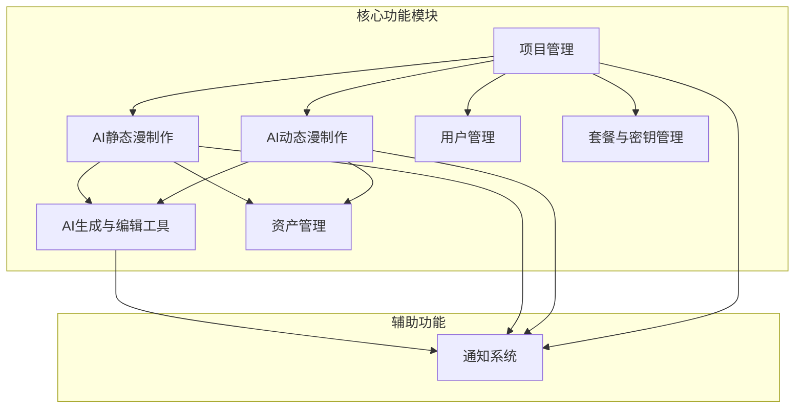
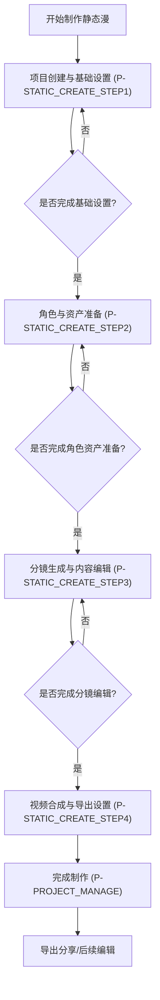
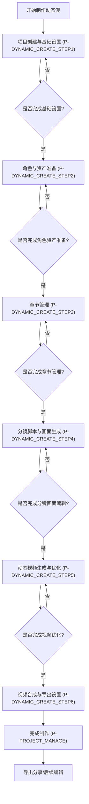
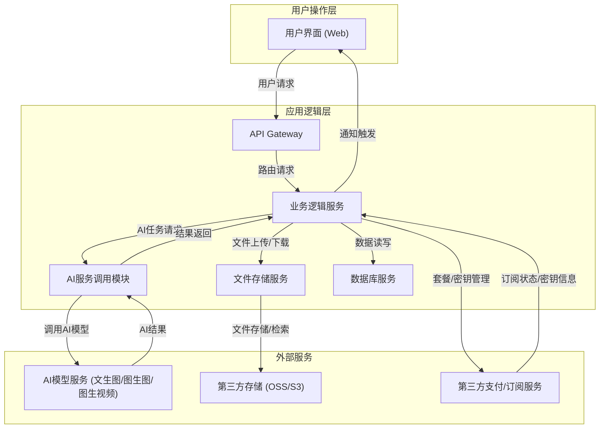

# AI漫剧速成工场产品需求文档

## 1. 产品概述

### 1.1 产品名称与定位

*   **产品名称:** AI漫剧速成工场
*   **产品定位:** 一款面向企业用户的Web端AI漫剧批量制作平台，旨在通过AI技术简化静态漫和动态漫的制作流程，提高生产效率，降低制作成本。

### 1.2 产品应用语言

*   **产品应用语言:** 简体中文

### 1.3 产品愿景与目标

*   **产品愿景:** 成为企业级AI漫剧内容生产的首选平台，赋能企业快速、高效地创作高质量的动漫短剧。
*   **产品目标:**
    *   提供一站式AI漫剧制作解决方案，覆盖从剧本创作到视频合成的全流程。
    *   显著缩短漫剧制作周期，降低人力成本。
    *   支持批量制作，满足企业级内容生产需求。
    *   提供灵活的素材管理和用户权限控制，确保内容安全和团队协作效率。

### 1.4 产品使用终端

*   **主要终端:** Web端桌面应用
*   **浏览器支持:** Chrome 90+、Firefox 88+、Safari 14+、Edge 90+
*   **分辨率支持:** 1024x768及以上分辨率，最佳体验为1920x1080
*   **响应式适配:** 支持1024px以上的所有桌面和平板设备。

### 1.5 核心价值主张

*   **高效批量生产:** 利用AI技术实现剧本拆分、画面生成、视频合成的自动化，大幅提升漫剧制作效率。
*   **降低制作门槛:** 简化复杂的漫剧制作流程，使非专业人员也能快速上手，降低对专业技能的依赖。
*   **灵活定制能力:** 提供丰富的AI生成参数和素材管理功能，支持用户根据需求定制画风、角色、场景等。
*   **企业级协作:** 支持多人协作编辑，提供用户管理和权限控制，满足团队化生产需求。

### 1.6 目标用户群体分析

*   **企业用户:** 动漫制作公司、内容创作团队、广告公司、自媒体工作室等需要批量生产动漫短剧内容的企业。
*   **内容创作者:** 编剧、导演、动画师等希望借助AI工具提升创作效率的专业人士。
*   **技术要求:** 具备基本的Web操作能力，对AI生成内容有一定接受度。

### 1.7 市场需求与竞品简析

*   **市场需求:** 随着短视频和内容消费的爆发式增长，对高质量、个性化动漫内容的需求日益旺盛。传统漫剧制作成本高、周期长，AI技术的引入为解决这一痛点提供了新的可能。企业用户对能够批量生产、快速迭代的AI漫剧制作工具需求迫切。
*   **竞品简析:** 市场上存在一些AI绘画、AI视频生成工具，但大多专注于单一环节或面向个人用户。缺乏一款能够整合全流程、支持批量生产、并提供企业级管理功能的综合性AI漫剧制作平台。本产品旨在填补这一市场空白。

### 1.8 浏览器兼容性要求

*   **主流浏览器:** 必须完全兼容Chrome、Firefox、Safari、Edge的最新稳定版本。
*   **性能优化:** 确保在上述浏览器中，页面加载速度快，操作流畅，无明显卡顿。

## 2. 功能规格

### 2.1 功能详述

#### 2.1.1 项目管理

| 功能ID | 功能名称 | 功能描述 | 优先级 |
|--------|---------|---------|--------|
| F-PROJECT_001 | 剧本列表展示 | 按静态漫和动态漫分类展示所有剧本，支持分页、排序。 | P0 |
| F-PROJECT_002 | 剧本创建 | 提供创建静态漫和动态漫剧本的入口，引导用户进入制作流程。 | P0 |
| F-PROJECT_003 | 剧本修改 | 允许用户对已创建剧本的基础信息、角色、分镜、合成设置等进行修改。 | P0 |
| F-PROJECT_004 | 剧本删除 | 支持删除指定剧本，删除前需二次确认。 | P0 |
| F-PROJECT_005 | 剧本搜索 | 提供搜索框，支持按剧本名称、ID、状态等关键词进行模糊搜索。 | P0 |
| F-PROJECT_006 | 项目状态显示 | 在剧本列表中清晰显示每个剧本的当前制作进度状态（如：草稿、进行中、已完成、失败）。 | P0 |

#### 2.1.2 资产管理

| 功能ID | 功能名称 | 功能描述 | 优先级 |
|--------|---------|---------|--------|
| F-ASSET_001 | 资产管理标签页 | 提供三个子标签页：图片类资产管理、音频资产管理、视频资产管理，支持标签页切换。 | P0 |
| F-ASSET_002 | 图片类资产列表展示 | 分类展示角色IP资产、场景资产，支持分页、排序。 | P0 |
| F-ASSET_003 | 音频资产列表展示 | 分类展示音乐BGM、声音克隆，支持分页、排序。 | P0 |
| F-ASSET_004 | 视频资产列表展示 | 分类展示视频特效，支持分页、排序。 | P0 |
| F-ASSET_005 | 资产创建 | 支持用户通过上传文件或系统生成方式创建各类资产，支持批量上传，提供进度反馈。生成类资产（如声音克隆）需记录源文件与生成ID关联关系。 | P0 |
| F-ASSET_006 | 资产搜索 | 提供搜索框，支持按资产名称、类型、标签等关键词进行模糊搜索。 | P0 |
| F-ASSET_007 | 资产编辑 | 允许用户编辑资产的名称、描述、标签等元数据，不同类型资产提供差异化编辑选项。 | P0 |
| F-ASSET_008 | 资产删除 | 支持删除指定资产，删除前需二次确认，不同类型资产删除逻辑略有差异。 | P0 |
| F-ASSET_009 | 资产预览/试听 | 提供图片预览、音频试听、视频预览功能，方便用户快速了解资产内容。 | P0 |

#### 2.1.3 用户管理

| 功能ID | 功能名称 | 功能描述 | 优先级 |
|--------|---------|---------|--------|
| F-USER_001 | 用户列表展示 | 展示系统所有用户的基本信息（用户名、角色、所属组织、创建时间等），支持分页、排序。 | P0 |
| F-USER_002 | 用户新增 | 支持新增用户账户，设置用户名、密码、角色、所属组织等。 | P0 |
| F-USER_003 | 用户删除 | 支持删除指定用户账户，删除前需二次确认。 | P0 |
| F-USER_004 | 组织创建 | 注册时创建组织，设置组织名称、描述等信息。 | P0 |
| F-USER_005 | 组织列表展示 | 展示当前用户可管理的所有组织信息，支持分页、排序。 | P0 |

#### 2.1.4 套餐与密钥管理

| 功能ID | 功能名称 | 功能描述 | 优先级 |
|--------|---------|---------|--------|
| F-PLAN_001 | 套餐订阅 | 展示不同服务套餐的详细信息（功能、价格、有效期），支持用户选择并订阅套餐。 | P0 |
| F-PLAN_002 | API密钥设置 | 提供界面供用户管理访问大模型的API密钥，支持添加、编辑、删除密钥。 | P0 |

#### 2.1.5 AI静态漫制作

| 功能ID | 功能名称 | 功能描述 | 优先级 |
|--------|---------|---------|--------|
| F-STATIC_001 | 基础信息设置 | 引导用户填写剧本名称、选择画风（文本提示词或参考图片二选一）、设置视频比例和分辨率、填写故事背景。 | P0 |
| F-STATIC_002 | 角色IP形象管理 | 支持用户生成、添加或选择角色IP形象。生成：基于输入角色特征介绍，结合基础信息生成角色形象IP（三张不同视角的角色立绘），支持修改提示词或上传参考图重新生成。选择：从素材库中选择图片作为角色IP形象，提供图片搜索功能。添加：通过"添加角色"按钮新增角色IP形象。 | P0 |
| F-STATIC_003 | 角色配音与旁白配置 | 为每个角色提供选择音色、音色效果试听功能。支持为每个角色设置默认音频参数，如音频速率。 | P0 |
| F-STATIC_004 | 分镜脚本创建 | 支持用户输入剧本章节脚本，通过AI拆书一键拆分为一系列分镜描述脚本，包含关联的角色、画面描述、旁白、对话等。每个分镜有唯一ID，支持对分镜描述剧本进行增删改编辑操作，调整不同分镜的顺序。 | P0 |
| F-STATIC_005 | 分镜画面批量生成 | 支持一键批量生成分镜画面图片，批量运行后在网页上出现通知。 | P0 |
| F-STATIC_006 | 分镜画面单镜修改 | 生成后可针对每段脚本分镜进行修改，如通过下拉多选方式修改关联角色、分镜提示词描述、剧本旁白/人物对话、分镜前后顺序等。针对每个分镜的画面支持独立另开一个工作流进行修改（类似Loveart采用对话的方式）。 | P0 |
| F-STATIC_007 | 分镜画面素材库操作 | 分镜画面提供一键存储到素材库供复用，也支持点击替换成素材库中的图片。 | P0 |
| F-STATIC_008 | 视频合成配置 | 配置视频设置，为分镜从素材库选择背景音乐，设置字幕样式等。 | P0 |
| F-STATIC_009 | 最终视频生成与导出 | 一键生成合成最终视频，并提供播放、下载和“一键跳转剪映编辑”功能。 | P0 |

#### 2.1.6 AI动态漫制作

| 功能ID | 功能名称 | 功能描述 | 优先级 |
|--------|---------|---------|--------|
| F-DYNAMIC_001 | 基础信息设置 | 引导用户填写剧本名称、选择画风（文本提示词或参考图片二选一）、设置视频比例和分辨率、填写故事背景。 | P0 |
| F-DYNAMIC_002 | 角色IP形象管理 | 支持用户生成或选择角色IP形象。生成：基于输入角色特征介绍，结合基础信息生成角色形象IP（三张不同视角的角色立绘），支持修改提示词或上传参考图重新生成。选择：从素材库中选择图片作为角色IP形象，提供图片搜索功能。 | P0 |
| F-DYNAMIC_003 | 角色配音与旁白配置 | 为每个角色提供选择音色、音色效果试听功能。支持为每个角色设置默认音频参数，如音频速率。 | P0 |
| F-DYNAMIC_004 | 章节管理 | 支持用户创建、删除、编辑章节内容，包括章节名称和章节文本。章节列表支持排序和筛选，方便用户管理多章节内容。 | P0 |
| F-DYNAMIC_005 | 分镜脚本创建 | 进入章节内容后，支持通过AI拆书一键将章节内容拆分为一系列分镜描述脚本，包含关联的角色、画面描述、旁白、对话等。每个分镜有唯一ID，支持对分镜描述剧本进行增删改编辑操作，调整不同分镜的顺序。支持多人合作共同创作。 | P0 |
| F-DYNAMIC_006 | 分镜首帧画面批量生成 | 支持一键批量生成分镜首帧画面图片，批量运行后在网页上出现通知。 | P0 |
| F-DYNAMIC_007 | 分镜首帧画面单镜修改 | 生成后可针对每段脚本分镜进行修改，如修改关联角色、分镜提示词描述、剧本旁白/人物对话、分镜前后顺序等。针对每个分镜的画面支持独立另开一个工作流进行修改（类似Loveart采用对话的方式）。分镜画面提供一键存储到素材库供复用。 | P0 |
| F-DYNAMIC_008 | 分镜视频生成 | 基于分镜首帧画面图片通过图生视频生成分镜视频，包含分镜画面、视频提示词（主体、动作、运镜三部分）。支持批量生成，也支持对单个分镜视频的修改，支持修改每个分镜的图片和提示词重新生成。生成后支持试播放。 | P0 |
| F-DYNAMIC_009 | 视频合成配置 | 配置视频设置，为分镜从素材库选择背景音乐，设置字幕样式等。 | P0 |
| F-DYNAMIC_010 | 最终视频生成与导出 | 一键生成合成最终视频，并提供播放、下载和“一键跳转剪映编辑”功能。 | P0 |

#### 2.1.7 AI生成与编辑工具

| 功能ID | 功能名称 | 功能描述 | 优先级 |
|--------|---------|---------|--------|
| F-AI_TOOL_001 | 文生图功能 | 基于用户输入的文本描述，调用AI模型生成角色和场景图片。 | P0 |
| F-AI_TOOL_002 | 图生图功能 | 基于用户上传的参考图片和文本描述，调用AI模型生成新图片。 | P0 |
| F-AI_TOOL_003 | 图生视频功能 | 将静态分镜图片转换为动态视频，支持用户输入视频提示词（主体、动作、运镜）。 | P0 |
| F-AI_TOOL_004 | 对话式编辑 | 支持类似Loveart的对话方式，用户通过文本指令与AI交互，对生成的图片或视频进行修改和优化。 | P0 |

#### 2.1.8 通知系统

| 功能ID | 功能名称 | 功能描述 | 优先级 |
|--------|---------|---------|--------|
| F-NOTIFY_001 | 任务通知 | AI批量生成任务（如分镜画面生成、分镜视频生成、最终视频合成）完成后，通过网页通知（如右上角消息提示、弹窗）告知用户。 | P0 |
| F-NOTIFY_002 | 状态提示 | 在用户操作过程中，提供实时的状态反馈，如“生成中”、“成功”、“失败”等提示信息。 | P0 |

### 2.2 功能模块间的关系图

## 3. 用户流程

### 3.1 用户旅程地图

| 阶段 | 用户目标 | 行为 | 触点 | 痛点 | 解决方案 | 体验 |
|---|---|---|---|---|---|---|
| **启动** | 了解产品，开始制作 | 访问网站，注册/登录，创建组织 | 网站首页，登录页，注册页 | 注册流程繁琐，组织概念不清晰 | 简化注册流程，引导组织创建，提供清晰指引 | 便捷 |
| **项目创建** | 新建漫剧项目 | 选择项目类型，填写基础信息 | 项目管理页，新建项目弹窗 | 信息填写复杂 | 分步引导，提供默认选项 | 清晰 |
| **资产准备** | 管理和选择资产 | 上传资产，搜索资产，选择资产 | 资产管理页，资产选择弹窗 | 资产查找困难，管理混乱 | 分类管理，强大搜索，资产预览 | 高效 |
| **AI生成** | 生成角色、分镜画面/视频 | 输入提示词，上传参考图，点击生成 | 角色管理页，分镜编辑页 | 生成效果不佳，调整复杂 | 对话式编辑，多轮优化，参数调整 | 智能 |
| **内容编辑** | 调整和优化内容 | 编辑分镜脚本，修改画面/视频 | 分镜编辑页，对话式编辑弹窗 | 编辑操作复杂，协作不便 | 直观编辑界面，多人协作支持 | 灵活 |
| **视频合成** | 生成最终视频 | 配置合成参数，点击合成 | 视频合成页 | 合成时间长，效果不满意 | 实时进度反馈，支持跳转外部编辑 | 可控 |
| **导出分享** | 获取最终成果 | 下载视频，分享链接 | 视频合成页，项目管理页 | 导出格式单一 | 多种导出格式，支持跳转剪映 | 多样 |
| **管理维护** | 管理用户、套餐、密钥 | 进入管理页面，进行增删改查 | 用户管理页，套餐管理页，密钥设置页 | 权限管理复杂 | 清晰的管理界面，权限细分 | 安全 |

### 3.2 关键业务流程图

#### 3.2.1 AI静态漫制作流程

#### 3.2.2 AI动态漫制作流程

### 3.3 各场景下的用户操作步骤

#### 3.3.1 创建新的AI静态漫项目

1.  用户登录系统，进入项目管理页（P-PROJECT_MANAGE）。
2.  点击“新建项目”按钮，选择“AI静态漫”。
3.  进入AI静态漫制作第一步：基础信息设置（P-STATIC_CREATE_STEP1）。
    *   用户输入剧本名称、故事背景。
    *   选择画风模式（文本提示词或参考图片），并输入提示词或上传参考图。
    *   选择视频比例和分辨率。
    *   点击“保存”并进入“下一步”。
4.  进入AI静态漫制作第二步：确认角色（P-STATIC_CREATE_STEP2）。
    *   用户点击“生成角色”按钮，输入角色特征，AI生成角色立绘。
    *   用户可选择修改提示词或上传参考图重新生成，或从素材库选择角色图片。
    *   为每个角色选择音色，试听效果，并设置默认音频参数。
    *   点击“保存”并进入“下一步”。如果需要修改之前的内容可以点击“上一步”。
5.  进入AI静态漫制作第三步：创建章节，生成分镜画面（P-STATIC_CREATE_STEP3）。
    *   用户输入剧本章节脚本。
    *   点击“AI拆书”按钮，AI自动拆分为分镜脚本。
    *   用户对分镜脚本进行增删改、调整顺序。
    *   点击“批量生成分镜画面”按钮，系统开始生成。
    *   生成完成后，用户可对单个分镜画面进行修改（如修改提示词、替换图片），或通过对话式编辑进行优化。
    *   点击“保存”并进入“下一步”。如果需要修改之前的内容可以点击“上一步”。
6.  进入AI静态漫制作第四步：合成最终视频（P-STATIC_CREATE_STEP4）。
    *   用户从素材库选择背景音乐。
    *   设置字幕样式。
    *   点击“生成最终视频”按钮。
    *   视频生成完成后，用户可播放、下载或点击“一键跳转剪映编辑”。
7.  项目创建完成，返回项目管理页（P-PROJECT_MANAGE）。

#### 3.3.2 管理资产
1.  用户登录系统，点击左侧菜单“资产管理”，进入资产管理页（P-ASSET_MANAGE）。
2.  资产管理页面包含三个子标签页：
    *   **图片类资产管理**：展示角色IP资产和场景资产
    *   **音频资产管理**：展示音乐BGM和声音克隆
    *   **视频资产管理**：展示视频特效
3.  在各资产类型标签页中，用户可以：
    *   使用搜索框查找特定资产。
    *   点击“上传资产”按钮，选择本地文件进行上传。
    *   点击资产卡片或列表项，预览图片、试听音频或预览视频。
    *   点击“编辑”按钮，修改资产的名称、描述、标签等元数据。
    *   点击“删除”按钮，删除指定资产（需二次确认）。
4.  用户可以通过分类标签或筛选器，快速定位不同类型的资产。

## 4. 数据流设计

### 4.1 数据结构与关系

*   **组织 (Organization):**
    *   `organization_id` (PK)
    *   `OrgName`
    *   `creator_user_id` (FK to User)
    *   `description`
    *   `resource_points`
    *   `created_at`
    *   `updated_at`
*   **用户 (User):**
    *   `user_id` (PK)
    *   `username`
    *   `password_hash`
    *   `role` (e.g., admin, editor)
    *   `organization_id` (FK to Organization)
    *   `phone` (手机号码)
    *   `mail` (邮箱)
    *   `status` (Active, Inactive)
    *   `created_at`
    *   `updated_at`
*   **项目 (Project):**
    *   `project_id` (PK)
    *   `project_name`
    *   `project_type` (static_comic, dynamic_comic)
    *   `status` (draft, in_progress, completed, failed)
    *   `creator_id` (FK to User)
    *   `created_at`
    *   `updated_at`
    *   `basic_info_json` (存储基础信息，如画风、比例、分辨率、故事背景)
*   **角色 (Character):**
    *   `character_id` (PK)
    *   `project_id` (FK to Project)
    *   `character_name`
    *   `description`
    *   `reference_images` (数组，AI生图成所需要的参考图，这里采用资产表,asset_id)
    *   `image_urls` (数组，存储角色立绘URL)
    *   `voice_id` (FK to Voice)
    *   `audio_params_json` (存储音频速率等参数)
    *   `created_at`
    *   `updated_at`
*   **分镜 (Storyboard):**
    *   `storyboard_id` (PK)
    *   `project_id` (FK to Project)
    *   `chapter_id` (FK to Chapter)
    *   `order_index`
    *   `script_content` (分镜脚本描述)
    *   `image_url` (静态漫画面URL / 动态漫首帧URL)
    *   `video_url` (动态漫分镜视频URL)
    *   `image_prompt` (画面生成提示词)
    *   `video_prompt` (视频生成提示词)
    *   `related_characters_json` (关联角色ID列表)
    *   `created_at`
    *   `updated_at`
*   **章节 (Chapter):**
    *   `chapter_id` (PK)
    *   `project_id` (FK to Project)
    *   `chapter_name`
    *   `content` (章节原始文本)
    *   `created_at`
    *   `updated_at`
*   **资产 (Asset):**
    *   `asset_id` (PK)
    *   `asset_name`
    *   `asset_type` (image, audio, video)
    *   `sub_type` (character_ip, scene, bgm, voice_clone, video_effect)
    *   `creation_method` (upload, generated) - 资产创建方式：上传/生成
    *   `file_url` - 上传类资产文件URL（可选）
    *   `generated_id` - 生成类资产ID（可选）
    *   `source_asset_id` - 源资产ID（生成类资产关联用，可选）
    *   `description`
    *   `tags` (数组)
    *   `character_views` (JSON, 仅character_ip类型) - 角色多视图信息
    *   `uploader_id` (FK to User)
    *   `created_at`
    *   `updated_at`
*   **套餐 (Plan):**
    *   `plan_id` (PK)
    *   `plan_name`
    *   `description`
    *   `price`
    *   `features_json` (包含的功能列表)
    *   `created_at`
    *   `updated_at`
*   **API密钥 (APIKey):**
    *   `key_id` (PK)
    *   `user_id` (FK to User)
    *   `key_name`
    *   `key_value` (加密存储)
    *   `provider` (e.g., OpenAI, Midjourney)
    *   `created_at`
    *   `updated_at`
*   **通知 (Notification):**
    *   `notification_id` (PK)
    *   `user_id` (FK to User)
    *   `type` (task_completed, status_update)
    *   `message`
    *   `related_project_id` (FK to Project, 可选)
    *   `is_read`
    *   `created_at`

### 4.2 关键数据流向图

### 4.3 数据存储与处理原则

1.  **数据安全:**
    *   所有敏感数据（如用户密码、API密钥）必须进行加密存储。
    *   数据传输采用HTTPS协议，确保数据在传输过程中的安全。
    *   实施严格的访问控制策略，只有授权用户和系统组件才能访问相应数据。
2.  **数据一致性:**
    *   采用事务管理确保数据操作的原子性、一致性、隔离性和持久性。
    *   对于分布式系统，考虑使用分布式事务或最终一致性策略。
3.  **数据可扩展性:**
    *   数据库设计应考虑未来的数据量增长，采用分库分表、读写分离等方案。
    *   文件存储采用云存储服务，具备高可用和弹性伸缩能力。
4.  **数据备份与恢复:**
    *   定期对数据库进行全量和增量备份，确保数据可恢复性。
    *   制定详细的数据恢复计划，以应对突发灾难。
5.  **数据处理:**
    *   AI生成任务采用异步处理机制，避免阻塞用户界面。
    *   大文件上传/下载支持断点续传。
    *   对用户上传的素材进行格式校验和安全扫描。

## 5. 页面规格

### 5.1 页面概览

#### 5.1.1 整体布局架构

*   **布局模式:** Web端智能布局 - 固定顶部导航栏 + 可折叠左侧菜单(240px/56px) + 主内容区(最小900px) + 智能右侧面板(300px，条件显示)。
*   **空间分配策略:**
    *   超大屏幕(≥1600px): 顶部60px + 左侧240px + 主内容区(动态) + 右侧300px。
    *   大屏幕(1400-1599px): 顶部60px + 左侧240px + 主内容区(动态)。右侧面板仅在≥1500px时显示，否则隐藏。
    *   中屏幕(1200-1399px): 顶部60px + 左侧240px + 主内容区(充满剩余空间)，右侧面板完全隐藏。
    *   小屏幕(1024-1199px): 顶部60px + 左侧56px(自动折叠) + 主内容区(充满剩余空间)。
*   **导航体系:** 顶部主导航 + 左侧功能菜单 + 面包屑导航。
*   **交互模式:** 主内容区切换 + 模态弹窗 + 侧边抽屉 + 顶部通知条。
*   **右侧面板智能控制:** 仅在屏幕宽度≥1500px且提供不可替代的核心辅助功能时显示，内容必须100%可选，主功能绝不依赖右侧面板，隐藏时所有信息必须在主内容区有完整替代展示。默认不使用。

#### 5.1.2 页面列表

| 页面ID | 页面名称 | 核心功能 | 布局类型 | 右侧面板 |
|--------|---------|---------|---------|---------|
| P-LOGIN | 登录页 | 用户登录 | 单栏居中 | 不适用 |
| P-REGISTER | 注册页 | 用户注册与组织创建 | 单栏居中 | 不适用 |
| P-PROJECT_MANAGE | 项目管理页 | 剧本列表、创建、搜索、管理 | 二栏布局 | 不使用 |
| P-ASSET_MANAGE | 资产管理页 | 资产列表、上传、搜索、管理 | 二栏布局 | 不使用 |
| P-USER_MANAGE | 用户管理页 | 用户列表、新增、删除、组织管理 | 二栏布局 | 不使用 |
| P-API_KEY_SETTING | API密钥设置页 | API密钥添加、编辑、删除 | 二栏布局 | 不使用 |
| P-STATIC_CREATE_STEP1 | AI静态漫制作第一步：基础信息设置 | 填写剧本基础信息、画风选择 | 二栏布局 | 不使用 |
| P-STATIC_CREATE_STEP2 | AI静态漫制作第二步：确认角色 | 角色IP生成/选择、配音配置 | 二栏布局 | 不使用 |
| P-STATIC_CREATE_STEP3 | AI静态漫制作第三步：创建章节，生成分镜画面 | 剧本拆分、分镜编辑、画面生成 | 二栏布局 | 不使用 |
| P-STATIC_CREATE_STEP4 | AI静态漫制作第四步：合成最终视频 | 视频合成配置、生成、导出 | 二栏布局 | 不使用 |
| P-DYNAMIC_CREATE_STEP1 | AI动态漫制作第一步：基础信息设置 | 填写剧本基础信息、画风选择 | 二栏布局 | 不使用 |
| P-DYNAMIC_CREATE_STEP2 | AI动态漫制作第二步：确认角色 | 角色IP生成/选择、配音配置 | 二栏布局 | 不使用 |
| P-DYNAMIC_CREATE_STEP3 | AI动态漫制作第三步：章节管理 | 章节创建、删除、编辑 | 二栏布局 | 不使用 |
| P-DYNAMIC_CREATE_STEP4 | AI动态漫制作第四步：分镜脚本与画面生成 | 剧本拆分、分镜编辑、首帧生成 | 二栏布局 | 不使用 |
| P-DYNAMIC_CREATE_STEP5 | AI动态漫制作第五步：生成分镜视频 | 分镜视频生成、编辑 | 二栏布局 | 不使用 |
| P-DYNAMIC_CREATE_STEP6 | AI动态漫制作第六步：合成最终视频 | 视频合成配置、生成、导出 | 二栏布局 | 不使用 |
| P-IMAGE_EDIT_DIALOG | 图片编辑弹窗 | 对话式图片编辑 | 模态弹窗 | 不适用 |
| P-VIDEO_EDIT_DIALOG | 视频编辑弹窗 | 对话式视频编辑 | 模态弹窗 | 不适用 |
| P-MATERIAL_SELECT_DIALOG | 素材选择弹窗 | 素材搜索、选择 | 模态弹窗 | 不适用 |
| P-CONFIRM_DIALOG | 确认对话框 | 操作二次确认 | 模态弹窗 | 不适用 |

### 5.2 页面详情

#### 5.2.1 登录页（P-LOGIN）

**布局架构设计：**
- 页面类型：功能型页面，用户身份验证入口。
- 布局模式：单栏居中布局，简洁明了。
- 空间分配：登录表单区域居中显示，背景为产品品牌元素或简洁背景。

**页面布局架构：**
- 顶部导航栏：无。
- 左侧菜单：无。
- 主内容区域：
    *   登录表单：包含用户名输入框、密码输入框、登录按钮、注册链接、忘记密码链接（暂不实现）。
  - 品牌Logo和产品名称。
- 右侧面板：无。

**响应式适配策略：**
- 超大屏幕(≥1600px)：登录表单区域最大宽度400px，居中显示。
- 大屏幕(1400-1599px)：登录表单区域最大宽度400px，居中显示。
- 中屏幕(1200-1399px)：登录表单区域最大宽度400px，居中显示。
- 小屏幕(1024-1199px)：登录表单区域最大宽度400px，居中显示。
- 平板端(768-1023px)：登录表单区域宽度自适应，最大宽度500px，居中显示。
- 移动端(<768px)：登录表单区域宽度100%，上下居中显示。

**组件尺寸规范：**
- 按钮尺寸：登录按钮高度40px，宽度100%。
- 输入框：用户名/密码输入框高度40px，宽度100%。
- 间距规范：输入框间距16px，表单元素与按钮间距24px。

**核心功能：**
用户身份验证，允许用户登录系统。

#### 5.2.2 项目管理页（P-PROJECT_MANAGE）

**布局架构设计：**
- 页面类型：列表管理页，核心功能入口。
- 布局模式：二栏布局，左侧菜单+主内容区。
- 空间分配：左侧菜单固定宽度，主内容区占据剩余空间。

**页面布局架构：**
- 顶部导航栏：Logo、全局搜索框、消息通知、用户头像 - 高度60px，固定定位。
- 左侧菜单：主功能导航菜单（项目管理、素材管理、用户管理、套餐管理、API密钥设置），当前选中“项目管理”，支持折叠 - 宽度240px(展开)/56px(折叠)。
- 主内容区域：核心展示区域，最小900px宽度。
  - 页面头部：页面标题“项目管理”、面包屑导航（首页 > 项目管理）、主要操作按钮组（“新建静态漫”、“新建动态漫”） - 高度52px。
  - 工具栏区域：搜索框（按剧本名称/ID搜索）、筛选条件（按类型、状态筛选）、批量操作按钮（批量删除） - 高度44px，紧凑布局。
  - 内容展示区域：剧本列表，采用表格形式展示。
  - 分页区域：分页控件，显示总数、每页条数选择、跳转功能 - 高度40px，右对齐。
- 右侧面板：不使用。

**响应式适配策略：**
- 超大屏幕(≥1600px)：左侧240px + 主内容区1360px+。
- 大屏幕(1400-1599px)：左侧240px + 主内容区1160px+。
- 中屏幕(1200-1399px)：强制二栏布局，左侧240px + 主内容区960px+。
- 小屏幕(1024-1199px)：左侧菜单自动折叠为56px，主内容区充满剩余空间。
- 平板端(768-1023px)：左侧菜单抽屉式，主内容区充满，表格列可折叠或横向滚动。
- 移动端(<768px)：单栏布局，左侧菜单隐藏，表格转换为卡片列表或仅显示核心列。

**组件尺寸规范：**
- 按钮尺寸：主要操作按钮36px高度，次要按钮32px高度。
- 输入框：搜索框36px高度。
- 表格行高：36px，支持紧凑模式。
- 图标尺寸：16-24px。
- 间距规范：组件间距8-16px，区域间距16-24px。

**核心功能：**
剧本列表展示、创建、修改、删除、搜索、状态显示。

**数据结构：**
| 列名 | 数据类型 | 宽度建议 | 是否可排序 | 操作功能 |
|------|---------|----------|----------|---------|
| 复选框 | 布尔值 | 40px | 否 | 多选 |
| 剧本名称 | 文本 | 200px | 是 | 点击进入编辑 |
| 类型 | 标签 | 100px | 是 | 静态漫/动态漫 |
| 状态 | 标签 | 100px | 是 | 草稿/进行中/已完成/失败 |
| 创建人 | 文本 | 120px | 是 | 用户名 |
| 创建时间 | 日期时间 | 160px | 是 | - |
| 操作 | 操作按钮组 | 180px | 否 | 编辑/删除/查看详情/继续制作 |

#### 5.2.3 资产管理页（P-ASSET_MANAGE）

**布局架构设计：**
- 页面类型：列表管理页，资产资源库。
- 布局模式：二栏布局，左侧菜单+主内容区。
- 空间分配：左侧菜单固定宽度，主内容区占据剩余空间。

**页面布局架构：**
- 顶部导航栏：Logo、全局搜索框、消息通知、用户头像 - 高度60px，固定定位。
- 左侧菜单：主功能导航菜单，当前选中“资产管理”，支持折叠 - 宽度240px(展开)/56px(折叠)。
- 主内容区域：核心展示区域，最小900px宽度。
  - 页面头部：页面标题“资产管理”、面包屑导航（首页 > 资产管理）、主要操作按钮组（“上传资产”） - 高度52px。
  - 标签页区域：三个子标签页（图片类资产管理、音频资产管理、视频资产管理），支持切换 - 高度40px。
    * 图片类资产管理：展示角色IP资产（支持多视图管理）、场景资产
    * 音频资产管理：展示音乐BGM、声音克隆（基于用户上传音频生成）
    * 视频资产管理：展示视频特效
  - 工具栏区域：搜索框（按资产名称/标签搜索）、筛选条件（按子类型筛选）、批量操作按钮（批量删除） - 高度44px，紧凑布局。
  - 内容展示区域：资产列表，采用表格形式展示。
  - 分页区域：分页控件，显示总数、每页条数选择、跳转功能 - 高度40px，右对齐。
- 右侧面板：

**响应式适配策略：**
- 超大屏幕(≥1600px)：左侧240px + 主内容区1360px+。
- 大屏幕(1400-1599px)：左侧240px + 主内容区1160px+。
- 中屏幕(1200-1399px)：强制二栏布局，左侧240px + 主内容区960px+。
- 小屏幕(1024-1199px)：左侧菜单自动折叠为56px，主内容区充满剩余空间。
- 平板端(768-1023px)：左侧菜单抽屉式，主内容区充满，表格列可折叠或横向滚动。
- 移动端(<768px)：单栏布局，左侧菜单隐藏，表格转换为卡片列表或仅显示核心列。

**组件尺寸规范：**
- 按钮尺寸：主要操作按钮36px高度，次要按钮32px高度。
- 输入框：搜索框36px高度。
- 表格行高：36px，支持紧凑模式。
- 图标尺寸：16-24px。
- 间距规范：组件间距8-16px，区域间距16-24px。

**核心功能：**
资产列表展示、上传、搜索、编辑、删除、预览/试听。

**数据结构：**
| 列名 | 数据类型 | 宽度建议 | 是否可排序 | 操作功能 |
|------|---------|----------|----------|---------|
| 复选框 | 布尔值 | 40px | 否 | 多选 |
| 资产名称 | 文本 | 200px | 是 | - |
| 类型 | 标签 | 100px | 是 | 图片/音频/视频 |
| 子类型 | 标签 | 120px | 是 | 角色IP/场景/音乐BGM/声音克隆/视频特效 |
| 上传人 | 文本 | 120px | 是 | 用户名 |
| 上传时间 | 日期时间 | 160px | 是 | - |
| 操作 | 操作按钮组 | 180px | 否 | 预览/试听/编辑/删除 |

#### 5.2.4 用户管理页（P-USER_MANAGE）

**布局架构设计：**
- 页面类型：列表管理页，用户账户管理。
- 布局模式：二栏布局，左侧菜单+主内容区。
- 空间分配：左侧菜单固定宽度，主内容区占据剩余空间。

**页面布局架构：**
- 顶部导航栏：Logo、全局搜索框、消息通知、用户头像 - 高度60px，固定定位。
- 左侧菜单：主功能导航菜单，当前选中“用户管理”，支持折叠 - 宽度240px(展开)/56px(折叠)。
- 主内容区域：核心展示区域，最小900px宽度。
  - 页面头部：页面标题“用户管理”、面包屑导航（首页 > 用户管理）、主要操作按钮组（“新增用户”） - 高度52px。
  - 工具栏区域：搜索框（按用户名/角色搜索）、筛选条件（按角色筛选）、批量操作按钮（批量删除） - 高度44px，紧凑布局。
  - 内容展示区域：用户列表，采用表格形式展示。
  - 分页区域：分页控件，显示总数、每页条数选择、跳转功能 - 高度40px，右对齐。
- 右侧面板：

**响应式适配策略：**
- 超大屏幕(≥1600px)：左侧240px + 主内容区1360px+。
- 大屏幕(1400-1599px)：左侧240px + 主内容区1160px+。
- 中屏幕(1200-1399px)：强制二栏布局，左侧240px + 主内容区960px+。
- 小屏幕(1024-1199px)：左侧菜单自动折叠为56px，主内容区充满剩余空间。
- 平板端(768-1023px)：左侧菜单抽屉式，主内容区充满，表格列可折叠或横向滚动。
- 移动端(<768px)：单栏布局，左侧菜单隐藏，表格转换为卡片列表或仅显示核心列。

**组件尺寸规范：**
- 按钮尺寸：主要操作按钮36px高度，次要按钮32px高度。
- 输入框：搜索框36px高度。
- 表格行高：36px，支持紧凑模式。
- 图标尺寸：16-24px。
- 间距规范：组件间距8-16px，区域间距16-24px。

**核心功能：**
用户列表展示、新增、删除。

**数据结构：**
| 列名 | 数据类型 | 宽度建议 | 是否可排序 | 操作功能 |
|------|---------|----------|----------|---------|
| 复选框 | 布尔值 | 40px | 否 | 多选 |
| 用户名 | 文本 | 180px | 是 | - |
| 所属组织 | 文本 | 180px | 是 | - |
| 角色 | 标签 | 120px | 是 | 管理员/编辑 |
| 创建时间 | 日期时间 | 160px | 是 | - |
| 操作 | 操作按钮组 | 120px | 否 | 删除 |

#### 5.2.5 套餐管理页（P-PLAN_MANAGE）

**布局架构设计：**
- 页面类型：列表管理页，服务套餐管理。
- 布局模式：二栏布局，左侧菜单+主内容区。
- 空间分配：左侧菜单固定宽度，主内容区占据剩余空间。

**页面布局架构：**
- 顶部导航栏：Logo、全局搜索框、消息通知、用户头像 - 高度60px，固定定位。
- 左侧菜单：主功能导航菜单，当前选中“套餐管理”，支持折叠 - 宽度240px(展开)/56px(折叠)。
- 主内容区域：核心展示区域，最小900px宽度。
  - 页面头部：页面标题“套餐管理”、面包屑导航（首页 > 套餐管理） - 高度52px。
  - 内容展示区域：套餐列表，采用卡片或表格形式展示套餐详情。

- 右侧面板：
- 超大屏幕(≥1600px)：左侧240px + 主内容区1360px+。
- 大屏幕(1400-1599px)：左侧240px + 主内容区1160px+。
- 中屏幕(1200-1399px)：强制二栏布局，左侧240px + 主内容区960px+。
- 小屏幕(1024-1199px)：左侧菜单自动折叠为56px，主内容区充满剩余空间。
- 平板端(768-1023px)：左侧菜单抽屉式，主内容区充满，套餐卡片可调整为单列或两列。
- 移动端(<768px)：单栏布局，左侧菜单隐藏，套餐卡片单列显示。

**组件尺寸规范：**
- 按钮尺寸：订阅按钮高度40px。
- 卡片尺寸：套餐卡片高度自适应，宽度根据列数均分。
- 间距规范：卡片间距24px，区域间距24px。

**核心功能：**
套餐订阅、套餐详情展示。

**数据结构：**
| 列名 | 数据类型 | 宽度建议 | 是否可排序 | 操作功能 |
|------|---------|----------|----------|---------|
| 套餐名称 | 文本 | 200px | 是 | - |
| 价格 | 数字 | 100px | 是 | - |
| 有效期 | 文本 | 120px | 是 | - |
| 包含功能 | 列表 | 300px | 否 | - |
| 操作 | 操作按钮组 | 100px | 否 | 订阅 |

#### 5.2.6 API密钥设置页（P-API_KEY_SETTING）

**布局架构设计：**
- 页面类型：列表管理页，API密钥配置。
- 布局模式：二栏布局，左侧菜单+主内容区。
- 空间分配：左侧菜单固定宽度，主内容区占据剩余空间。

**页面布局架构：**
- 顶部导航栏：Logo、全局搜索框、消息通知、用户头像 - 高度60px，固定定位。
- 左侧菜单：主功能导航菜单，当前选中“API密钥设置”，支持折叠 - 宽度240px(展开)/56px(折叠)。
- 主内容区域：核心展示区域，最小900px宽度。
  - 页面头部：页面标题“API密钥设置”、面包屑导航（首页 > API密钥设置）、主要操作按钮组（“新增密钥”） - 高度52px。
  - 工具栏区域：搜索框（按密钥名称/提供商搜索） - 高度44px，紧凑布局。
  - 内容展示区域：API密钥列表，采用表格形式展示。
  - 分页区域：分页控件，显示总数、每页条数选择、跳转功能 - 高度40px，右对齐。
- 右侧面板：

**响应式适配策略：**
- 超大屏幕(≥1600px)：左侧240px + 主内容区1360px+。
- 大屏幕(1400-1599px)：左侧240px + 主内容区1160px+。
- 中屏幕(1200-1399px)：强制二栏布局，左侧240px + 主内容区960px+。
- 小屏幕(1024-1199px)：左侧菜单自动折叠为56px，主内容区充满剩余空间。
- 平板端(768-1023px)：左侧菜单抽屉式，主内容区充满，表格列可折叠或横向滚动。
- 移动端(<768px)：单栏布局，左侧菜单隐藏，表格转换为卡片列表或仅显示核心列。

**组件尺寸规范：**
- 按钮尺寸：主要操作按钮36px高度，次要按钮32px高度。
- 输入框：搜索框36px高度。
- 表格行高：36px，支持紧凑模式。
- 图标尺寸：16-24px。
- 间距规范：组件间距8-16px，区域间距16-24px。

**核心功能：**
API密钥添加、编辑、删除。

**数据结构：**
| 列名 | 数据类型 | 宽度建议 | 是否可排序 | 操作功能 |
|------|---------|----------|----------|---------|
| 密钥名称 | 文本 | 200px | 是 | - |
| 提供商 | 文本 | 150px | 是 | - |
| 创建时间 | 日期时间 | 160px | 是 | - |
| 操作 | 操作按钮组 | 180px | 否 | 编辑/删除 |

#### 5.2.7 AI静态漫制作第一步：基础信息设置（P-STATIC_CREATE_STEP1）

**布局架构设计：**
- 页面类型：表单页，引导用户输入项目基础信息。
- 布局模式：二栏布局，左侧菜单+主内容区。
- 空间分配：左侧菜单固定宽度，主内容区占据剩余空间。

**页面布局架构：**
- 顶部导航栏：Logo、全局搜索框、消息通知、用户头像 - 高度60px，固定定位。
- 左侧菜单：主功能导航菜单，当前选中“项目管理”，支持折叠 - 宽度240px(展开)/56px(折叠)。
- 主内容区域：核心展示区域，最小900px宽度。
- 右侧面板：
  - 步骤指示器：显示当前制作进度，包含所有步骤名称和当前位置：
    1. 基础信息设置（当前）
    2. 确认角色
    3. 创建章节，生成分镜画面
    4. 合成最终视频
  - 表单区域：
    *   剧本名称（输入框）
    *   故事背景（多行文本框）
    *   画风选择（单选：文本提示词/参考图片）
    *   画风提示词（文本框，画风选择文本提示词时显示）
    *   画风参考图（上传组件，画风选择参考图片时显示）
    *   视频比例（下拉选择）
    *   分辨率（下拉选择）
  - 操作按钮区：上一步（禁用）、下一步、保存草稿 - 高度60px，右对齐。

**响应式适配策略：**
- 超大屏幕(≥1600px)：左侧240px + 主内容区1360px+。
- 大屏幕(1400-1599px)：左侧240px + 主内容区1160px+。
- 中屏幕(1200-1399px)：强制二栏布局，左侧240px + 主内容区960px+。
- 小屏幕(1024-1199px)：左侧菜单自动折叠为56px，主内容区充满剩余空间。
- 平板端(768-1023px)：左侧菜单抽屉式，主内容区充满，表单元素宽度自适应。
- 移动端(<768px)：单栏布局，左侧菜单隐藏，表单元素宽度100%。

**组件尺寸规范：**
- 按钮尺寸：下一步/保存草稿按钮高度40px。
- 输入框：36px高度，文本域高度自适应。
- 间距规范：表单项间距16-24px，区域间距24px。

**核心功能：**
填写剧本基础信息、选择画风、设置视频参数。

#### 5.2.8 AI静态漫制作第二步：确认角色（P-STATIC_CREATE_STEP2）

**布局架构设计：**
- 页面类型：表单页，角色IP和配音配置。
- 布局模式：二栏布局，左侧菜单+主内容区。
- 空间分配：左侧菜单固定宽度，主内容区占据剩余空间。

**页面布局架构：**
- 顶部导航栏：Logo、全局搜索框、消息通知、用户头像 - 高度60px，固定定位。
- 左侧菜单：主功能导航菜单，当前选中“项目管理”，支持折叠 - 宽度240px(展开)/56px(折叠)。
- 主内容区域：核心展示区域，最小900px宽度。
  - 页面头部：页面标题“AI静态漫制作 - 确认角色”、面包屑导航（首页 > 项目管理 > AI静态漫制作） - 高度52px。
  - 步骤指示器：显示当前制作进度，包含所有步骤名称和当前位置：
    1. 基础信息设置
    2. 确认角色（当前）
    3. 创建章节，生成分镜画面
    4. 合成最终视频
  - 角色列表：
    *   每个角色卡片：包含角色名称、形象预览图、生成/选择按钮、配音配置区域。
    *   “新增角色”按钮。
  - 角色配音弹窗配置：
    *   音色选择按钮（选择已有声音或者克隆声音，管理音色资产）
    *   试听按钮
    *   音频速率设置（滑块/输入框）
  - 旁白声音配置:
    *   音色选择按钮（选择已有声音或者克隆声音，管理音色资产）
    *   试听按钮
    *   音频速率设置（滑块/输入框）
- 右侧面板：

**响应式适配策略：**
- 超大屏幕(≥1600px)：左侧240px + 主内容区1360px+。
- 大屏幕(1400-1599px)：左侧240px + 主内容区1160px+。
- 中屏幕(1200-1399px)：强制二栏布局，左侧240px + 主内容区960px+。
- 小屏幕(1024-1199px)：左侧菜单自动折叠为56px，主内容区充满剩余空间。
- 平板端(768-1023px)：左侧菜单抽屉式，主内容区充满，角色卡片可调整为单列或两列。
- 移动端(<768px)：单栏布局，左侧菜单隐藏，角色卡片单列显示。

**组件尺寸规范：**
- 按钮尺寸：下一步/保存草稿按钮高度40px。
- 输入框：36px高度。
- 角色卡片：高度自适应，宽度根据列数均分。
- 间距规范：角色卡片间距24px，区域间距24px。

**核心功能：**
角色IP形象生成/选择、角色配音和旁白配音。

#### 5.2.9 AI静态漫制作第三步：创建章节，生成分镜画面（P-STATIC_CREATE_STEP3）

**布局架构设计：**
- 页面类型：编辑页，分镜脚本和画面生成。
- 布局模式：二栏布局，左侧菜单+主内容区。
- 空间分配：左侧菜单固定宽度，主内容区占据剩余空间。

**页面布局架构：**
- 顶部导航栏：Logo、全局搜索框、消息通知、用户头像 - 高度60px，固定定位。
- 左侧菜单：主功能导航菜单，当前选中“项目管理”，支持折叠 - 宽度240px(展开)/56px(折叠)。
- 主内容区域：核心展示区域，最小900px宽度。
  - 页面头部：页面标题“AI静态漫制作 - 创建章节，生成分镜画面”、面包屑导航（首页 > 项目管理 > AI静态漫制作） - 高度52px。
  - 步骤指示器：显示当前制作进度，包含所有步骤名称和当前位置：
    1. 基础信息设置
    2. 确认角色
    3. 创建章节，生成分镜画面（当前）
    4. 合成最终视频
  - 章节输入区：
    *   章节标题（输入框）
    *   章节内容（多行文本框）
    *   “AI拆书”按钮
  - 分镜列表：
    *   每个分镜卡片：包含分镜ID、脚本内容、画面预览图、角色多选下拉框、添加角色按钮、编辑按钮、删除按钮、调整顺序手柄。
    *   “批量生成分镜画面”按钮
- 右侧面板：

**响应式适配策略：**
- 超大屏幕(≥1600px)：左侧240px + 主内容区1360px+。
- 大屏幕(1400-1599px)：左侧240px + 主内容区1160px+。
- 中屏幕(1200-1399px)：强制二栏布局，左侧240px + 主内容区960px+。
- 小屏幕(1024-1199px)：左侧菜单自动折叠为56px，主内容区充满剩余空间。
- 平板端(768-1023px)：左侧菜单抽屉式，主内容区充满，分镜卡片可调整为单列或两列。
- 移动端(<768px)：单栏布局，左侧菜单隐藏，分镜卡片单列显示。

**组件尺寸规范：**
- 按钮尺寸：下一步/保存草稿按钮高度40px。
- 输入框：36px高度，文本域高度自适应。
- 分镜卡片：高度自适应，宽度根据列数均分。
- 间距规范：分镜卡片间距24px，区域间距24px。

**核心功能：**
AI拆分剧本为分镜脚本、分镜脚本编辑、分镜画面批量生成、单分镜修改、素材替换。

#### 5.2.10 AI静态漫制作第四步：合成最终视频（P-STATIC_CREATE_STEP4）

**布局架构设计：**
- 页面类型：编辑页，视频合成与导出。
- 布局模式：二栏布局，左侧菜单+主内容区。
- 空间分配：左侧菜单固定宽度，主内容区占据剩余空间。

**页面布局架构：**
- 顶部导航栏：Logo、全局搜索框、消息通知、用户头像 - 高度60px，固定定位。
- 左侧菜单：主功能导航菜单，当前选中“项目管理”，支持折叠 - 宽度240px(展开)/56px(折叠)。
- 主内容区域：核心展示区域，最小900px宽度。
  - 页面头部：页面标题“AI静态漫制作 - 合成最终视频”、面包屑导航（首页 > 项目管理 > AI静态漫制作） - 高度52px。
  - 步骤指示器：显示当前制作进度，包含所有步骤名称和当前位置：
    1. 基础信息设置
    2. 确认角色
    3. 创建章节，生成分镜画面
    4. 合成最终视频（当前）
  - 视频合成配置区：
    *   背景音乐选择（下拉选择，可从资产库选择）
    *   字幕样式设置（字体、颜色、大小等）
  - 视频区：显示合成后的视频播放器、生成最终视频、下载、一键跳转剪映编辑。
  - 操作按钮区：上一步、下一步（禁用）、保存草稿 - 高度60px，右对齐。

**响应式适配策略：**
- 超大屏幕(≥1600px)：左侧240px + 主内容区1360px+。
- 大屏幕(1400-1599px)：左侧240px + 主内容区1160px+。
- 中屏幕(1200-1399px)：强制二栏布局，左侧240px + 主内容区960px+。
- 小屏幕(1024-1199px)：左侧菜单自动折叠为56px，主内容区充满剩余空间。
- 平板端(768-1023px)：左侧菜单抽屉式，主内容区充满，视频播放器宽度自适应。
- 移动端(<768px)：单栏布局，左侧菜单隐藏，视频播放器宽度100%。

**组件尺寸规范：**
- 按钮尺寸：生成最终视频/下载按钮高度40px。
- 输入框：36px高度。
- 视频播放器：宽度自适应，高度按比例。
- 间距规范：组件间距16-24px，区域间距24px。

**核心功能：**
配置视频设置、生成最终视频、播放、下载、跳转剪映编辑。

#### 5.2.11 AI动态漫制作第一步：基础信息设置（P-DYNAMIC_CREATE_STEP1）

**布局架构设计：**
- 页面类型：表单页，引导用户输入项目基础信息。
- 布局模式：二栏布局，左侧菜单+主内容区。
- 空间分配：左侧菜单固定宽度，主内容区占据剩余空间。

**页面布局架构：**
- 顶部导航栏：Logo、全局搜索框、消息通知、用户头像 - 高度60px，固定定位。
- 左侧菜单：主功能导航菜单，当前选中“项目管理”，支持折叠 - 宽度240px(展开)/56px(折叠)。
- 主内容区域：核心展示区域，最小900px宽度。
  - 页面头部：页面标题“AI动态漫制作 - 基础信息设置”、面包屑导航（首页 > 项目管理 > AI动态漫制作） - 高度52px。
  - 步骤指示器：显示当前制作进度，包含所有步骤名称和当前位置：
    1. 基础信息设置（当前）
    2. 确认角色
    3. 章节管理
    4. 分镜脚本与画面生成
    5. 生成分镜视频
    6. 合成最终视频
  - 表单区域：
    *   剧本名称（输入框）
    *   故事背景（多行文本框）
    *   画风选择（单选：文本提示词/参考图片）
    *   画风提示词（文本框，画风选择文本提示词时显示）
    *   画风参考图（上传组件，画风选择参考图片时显示）
    *   视频比例（下拉选择）
    *   分辨率（下拉选择）
- 右侧面板：

**响应式适配策略：**
- 超大屏幕(≥1600px)：左侧240px + 主内容区1360px+。
- 大屏幕(1400-1599px)：左侧240px + 主内容区1160px+。
- 中屏幕(1200-1399px)：强制二栏布局，左侧240px + 主内容区960px+。
- 小屏幕(1024-1199px)：左侧菜单自动折叠为56px，主内容区充满剩余空间。
- 平板端(768-1023px)：左侧菜单抽屉式，主内容区充满，表单元素宽度自适应。
- 移动端(<768px)：单栏布局，左侧菜单隐藏，表单元素宽度100%。

**组件尺寸规范：**
- 按钮尺寸：下一步/保存草稿按钮高度40px。
- 输入框：36px高度，文本域高度自适应。
- 间距规范：表单项间距16-24px，区域间距24px。

**核心功能：**
填写剧本基础信息、选择画风、设置视频参数。

#### 5.2.12 AI动态漫制作第二步：确认角色（P-DYNAMIC_CREATE_STEP2）

**布局架构设计：**
- 页面类型：表单页，角色IP和配音配置。
- 布局模式：二栏布局，左侧菜单+主内容区。
- 空间分配：左侧菜单固定宽度，主内容区占据剩余空间。

**页面布局架构：**
- 顶部导航栏：Logo、全局搜索框、消息通知、用户头像 - 高度60px，固定定位。
- 左侧菜单：主功能导航菜单，当前选中“项目管理”，支持折叠 - 宽度240px(展开)/56px(折叠)。
- 主内容区域：核心展示区域，最小900px宽度。
  - 页面头部：页面标题“AI动态漫制作 - 确认角色”、面包屑导航（首页 > 项目管理 > AI动态漫制作） - 高度52px。
  - 步骤指示器：显示当前制作进度，包含所有步骤名称和当前位置：
    1. 基础信息设置
    2. 确认角色（当前）
    3. 章节管理
    4. 分镜脚本与画面生成
    5. 生成分镜视频
    6. 合成最终视频
  - 角色列表：
    *   每个角色卡片：包含角色名称、形象预览图、生成/选择按钮、配音配置区域。
    *   “新增角色”按钮。
  - 角色配音弹窗配置：
    *   音色选择按钮（选择已有声音或者克隆声音，管理音色资产）
    *   试听按钮
    *   音频速率设置（滑块/输入框）
  - 旁白声音配置:
    *   音色选择按钮（选择已有声音或者克隆声音，管理音色资产）
    *   试听按钮
    *   音频速率设置（滑块/输入框）
  - 操作按钮区：上一步、下一步、保存草稿 - 高度60px，右对齐。

**响应式适配策略：**
- 超大屏幕(≥1600px)：左侧240px + 主内容区1360px+。
- 大屏幕(1400-1599px)：左侧240px + 主内容区1160px+。
- 中屏幕(1200-1399px)：强制二栏布局，左侧240px + 主内容区960px+。
- 小屏幕(1024-1199px)：左侧菜单自动折叠为56px，主内容区充满剩余空间。
- 平板端(768-1023px)：左侧菜单抽屉式，主内容区充满，角色卡片可调整为单列或两列。
- 移动端(<768px)：单栏布局，左侧菜单隐藏，角色卡片单列显示。

**组件尺寸规范：**
- 按钮尺寸：下一步/保存草稿按钮高度40px。
- 输入框：36px高度。
- 角色卡片：高度自适应，宽度根据列数均分。
- 间距规范：角色卡片间距24px，区域间距24px。

**核心功能：**
角色IP形象生成/选择、角色配音和旁白配音。

#### 5.2.13 AI动态漫制作第三步：创建章节，生成分镜画面（P-DYNAMIC_CREATE_STEP3）

**布局架构设计：**
- 页面类型：编辑页，分镜脚本和首帧画面生成。
- 布局模式：二栏布局，左侧菜单+主内容区。
- 空间分配：左侧菜单固定宽度，主内容区占据剩余空间。

**页面布局架构：**
- 顶部导航栏：Logo、全局搜索框、消息通知、用户头像 - 高度60px，固定定位。
- 左侧菜单：主功能导航菜单，当前选中“项目管理”，支持折叠 - 宽度240px(展开)/56px(折叠)。
- 主内容区域：核心展示区域，最小900px宽度。
  - 页面头部：页面标题“AI动态漫制作 - 章节管理”、面包屑导航（首页 > 项目管理 > AI动态漫制作） - 高度52px。
  - 步骤指示器：显示当前制作进度，包含所有步骤名称和当前位置：
    1. 基础信息设置
    2. 确认角色
    3. 章节管理（当前）
    4. 分镜脚本与画面生成
    5. 生成分镜视频
    6. 合成最终视频
  - 章节管理区：
    *   章节列表（包含章节名称、创建时间、操作按钮）
    *   “新增章节”按钮
    *   章节编辑功能（修改章节名称和内容）
    *   章节删除功能（带二次确认）
  - 章节内容预览区：
    *   选中章节时显示章节内容预览
    *   章节内容编辑区域
  - 操作按钮区：上一步、下一步、保存草稿 - 高度60px，右对齐。
- 右侧面板：
**响应式适配策略：**
- 超大屏幕(≥1600px)：左侧240px + 主内容区1360px+。
- 大屏幕(1400-1599px)：左侧240px + 主内容区1160px+。
- 中屏幕(1200-1399px)：强制二栏布局，左侧240px + 主内容区960px+。
- 小屏幕(1024-1199px)：左侧菜单自动折叠为56px，主内容区充满剩余空间。
- 平板端(768-1023px)：左侧菜单抽屉式，主内容区充满，分镜卡片可调整为单列或两列。
- 移动端(<768px)：单栏布局，左侧菜单隐藏，分镜卡片单列显示。

**组件尺寸规范：**
- 按钮尺寸：下一步/保存草稿按钮高度40px。
- 输入框：36px高度，文本域高度自适应。
- 分镜卡片：高度自适应，宽度根据列数均分。
- 间距规范：分镜卡片间距24px，区域间距24px。

**核心功能：**
AI拆分剧本为分镜脚本、分镜脚本编辑、分镜首帧画面批量生成、单镜修改、素材替换。

#### 5.2.14 AI动态漫制作第四步：生成章节分镜视频（P-DYNAMIC_CREATE_STEP4）

**布局架构设计：**
- 页面类型：编辑页，分镜视频生成与编辑。
- 布局模式：二栏布局，左侧菜单+主内容区。
- 空间分配：左侧菜单固定宽度，主内容区占据剩余空间。

**页面布局架构：**
- 顶部导航栏：Logo、全局搜索框、消息通知、用户头像 - 高度60px，固定定位。
- 左侧菜单：主功能导航菜单，当前选中“项目管理”，支持折叠 - 宽度240px(展开)/56px(折叠)。
- 主内容区域：核心展示区域，最小900px宽度。
  - 页面头部：页面标题“AI动态漫制作 - 分镜脚本与画面生成”、面包屑导航（首页 > 项目管理 > AI动态漫制作） - 高度52px。
  - 步骤指示器：显示当前制作进度，包含所有步骤名称和当前位置：
    1. 基础信息设置
    2. 确认角色
    3. 章节管理
    4. 分镜脚本与画面生成（当前）
    5. 生成分镜视频
    6. 合成最终视频
  - 章节选择区：
    *   章节下拉选择器（选择需要处理的章节）
  - 分镜脚本编辑区：
    *   章节内容显示
    *   “AI拆书”按钮（将章节内容拆分为分镜脚本）
    *   分镜列表：每个分镜卡片包含分镜ID、脚本内容、编辑按钮、删除按钮、调整顺序手柄
  - 分镜画面生成区：
    *   “批量生成分镜首帧”按钮
    *   分镜首帧预览图
    *   单镜修改功能
  - 分镜视频列表：
    *   每个分镜视频卡片：包含分镜ID、首帧画面、视频播放器、视频提示词（主体、动作、运镜）输入框、编辑按钮、删除按钮、调整顺序手柄。
    *   “批量生成分镜视频”按钮
  - 操作按钮区：上一步、下一步、保存草稿 - 高度60px，右对齐。
- 右侧面板：
**响应式适配策略：**
- 超大屏幕(≥1600px)：左侧240px + 主内容区1360px+。
- 大屏幕(1400-1599px)：左侧240px + 主内容区1160px+。
- 中屏幕(1200-1399px)：强制二栏布局，左侧240px + 主内容区960px+。
- 小屏幕(1024-1199px)：左侧菜单自动折叠为56px，主内容区充满剩余空间。
- 平板端(768-1023px)：左侧菜单抽屉式，主内容区充满，分镜视频卡片可调整为单列或两列。
- 移动端(<768px)：单栏布局，左侧菜单隐藏，分镜视频卡片单列显示。

**组件尺寸规范：**
- 按钮尺寸：下一步/保存草稿按钮高度40px。
- 输入框：36px高度。
- 分镜视频卡片：高度自适应，宽度根据列数均分。
- 视频播放器：宽度自适应，高度按比例。
- 间距规范：分镜视频卡片间距24px，区域间距24px。

**核心功能：**
基于首帧图片生成分镜视频、分镜视频参数调整、单镜视频修改、试播放。

#### 5.2.15 AI动态漫制作第五步：合成最终视频（P-DYNAMIC_CREATE_STEP5）

**布局架构设计：**
- 页面类型：编辑页，视频合成与导出。
- 布局模式：二栏布局，左侧菜单+主内容区。
- 空间分配：左侧菜单固定宽度，主内容区占据剩余空间。

**页面布局架构：**
- 顶部导航栏：Logo、全局搜索框、消息通知、用户头像 - 高度60px，固定定位。
- 左侧菜单：主功能导航菜单，当前选中“项目管理”，支持折叠 - 宽度240px(展开)/56px(折叠)。
- 主内容区域：核心展示区域，最小900px宽度。
  - 页面头部：页面标题“AI动态漫制作 - 生成分镜视频”、面包屑导航（首页 > 项目管理 > AI动态漫制作） - 高度52px。
  - 步骤指示器：显示当前制作进度，包含所有步骤名称和当前位置：
    1. 基础信息设置
    2. 确认角色
    3. 章节管理
    4. 分镜脚本与画面生成
    5. 生成分镜视频（当前）
    6. 合成最终视频
  - 视频合成配置区：
    *   背景音乐选择（下拉选择，可从资产库选择）
    *   字幕样式设置（字体、颜色、大小等）
  - 视频预览区：显示合成后的视频播放器。
  - 操作按钮区：上一步、生成最终视频、下载、一键跳转剪映编辑 - 高度60px，右对齐。
- 右侧面板：不使用。

**响应式适配策略：**
- 超大屏幕(≥1600px)：左侧240px + 主内容区1360px+。
- 大屏幕(1400-1599px)：左侧240px + 主内容区1160px+。
- 中屏幕(1200-1399px)：强制二栏布局，左侧240px + 主内容区960px+。
- 小屏幕(1024-1199px)：左侧菜单自动折叠为56px，主内容区充满剩余空间。
- 平板端(768-1023px)：左侧菜单抽屉式，主内容区充满，视频播放器宽度自适应。
- 移动端(<768px)：单栏布局，左侧菜单隐藏，视频播放器宽度100%。

**组件尺寸规范：**
- 按钮尺寸：生成最终视频/下载按钮高度40px。
- 输入框：36px高度。
- 视频播放器：宽度自适应，高度按比例。
- 间距规范：组件间距16-24px，区域间距24px。

**核心功能：**
配置视频设置、生成最终视频、播放、下载、跳转剪映编辑。

#### 5.2.16 图片编辑弹窗（P-IMAGE_EDIT_DIALOG）

**布局架构设计：**
- 页面类型：模态弹窗，用于对话式图片编辑。
- 布局模式：居中模态弹窗。
- 空间分配：弹窗内容区域自适应，最大宽度和高度限制。

**页面布局架构：**
- 顶部导航栏：不适用。
- 左侧菜单：不适用。
- 主内容区域：
  - 弹窗标题：图片编辑。
  - 图片预览区：显示待编辑图片。
  - 对话输入区：文本输入框，用于用户输入编辑指令。
  - 历史对话区：显示用户与AI的对话历史。
  - 操作按钮：发送指令、重新生成、完成编辑。

**响应式适配策略：**
- 弹窗宽度：桌面端最大宽度800px，高度最大90%视口高度。
- 平板端/移动端：弹窗宽度自适应，最大宽度90%视口宽度，高度最大90%视口高度。

**组件尺寸规范：**
- 按钮尺寸：发送/完成按钮高度36px。
- 输入框：对话输入框高度36px。
- 图片预览区：宽度自适应，高度按比例。
- 间距规范：组件间距12-16px。

**核心功能：**
对话式图片编辑，用户通过文本指令与AI交互，对生成的图片进行修改和优化。

#### 5.2.17 视频编辑弹窗（P-VIDEO_EDIT_DIALOG）

**布局架构设计：**
- 页面类型：模态弹窗，用于对话式视频编辑。
- 布局模式：居中模态弹窗。
- 空间分配：弹窗内容区域自适应，最大宽度和高度限制。

**页面布局架构：**
- 顶部导航栏：不适用。
- 左侧菜单：不适用。
- 主内容区域：
  - 弹窗标题：视频编辑。
  - 视频预览区：显示待编辑视频播放器。
  - 对话输入区：文本输入框，用于用户输入编辑指令。
  - 历史对话区：显示用户与AI的对话历史。
  - 操作按钮：发送指令、重新生成、完成编辑。
- 右侧面板：不适用。

**响应式适配策略：**
- 弹窗宽度：桌面端最大宽度800px，高度最大90%视口高度。
- 平板端/移动端：弹窗宽度自适应，最大宽度90%视口宽度，高度最大90%视口高度。

**组件尺寸规范：**
- 按钮尺寸：发送/完成按钮高度36px。
- 输入框：对话输入框高度36px。
- 视频预览区：宽度自适应，高度按比例。
- 间距规范：组件间距12-16px。

**核心功能：**
对话式视频编辑，用户通过文本指令与AI交互，对生成的视频进行修改和优化。

#### 5.2.18 资产选择弹窗（P-ASSET_SELECT_DIALOG）

**布局架构设计：**
- 页面类型：模态弹窗，用于选择资产。
- 布局模式：居中模态弹窗。
- 空间分配：弹窗内容区域自适应，最大宽度和高度限制。

**页面布局架构：**
- 顶部导航栏：不适用。
- 左侧菜单：不适用。
- 主内容区域：
  - 弹窗标题：选择资产。
  - 搜索框：按资产名称/标签搜索。
  - 筛选条件：按类型、子类型筛选。
  - 资产列表：以网格或列表形式展示资产，支持多选。
  - 操作按钮：确定、取消。
- 右侧面板：不适用。

**响应式适配策略：**
- 弹窗宽度：桌面端最大宽度900px，高度最大90%视口高度。
- 平板端/移动端：弹窗宽度自适应，最大宽度90%视口宽度，高度最大90%视口高度。

**组件尺寸规范：**
- 按钮尺寸：确定/取消按钮高度36px。
- 输入框：搜索框36px高度。
- 资产卡片：高度自适应，宽度根据列数均分。
- 间距规范：组件间距12-16px。

**核心功能：**
提供资产搜索、筛选和选择功能，方便用户从资产库中选择所需资源。

#### 5.2.19 确认对话框（P-CONFIRM_DIALOG）

**布局架构设计：**
- 页面类型：模态弹窗，用于二次确认操作。
- 布局模式：居中模态弹窗。
- 空间分配：弹窗内容区域自适应，宽度和高度较小。

**页面布局架构：**
- 顶部导航栏：不适用。
- 左侧菜单：不适用。
- 主内容区域：
  - 弹窗标题：确认操作。
  - 提示信息：显示需要确认的操作内容（如“确定删除选中的项目吗？”）。
  - 操作按钮：确定、取消。
- 右侧面板：不适用。

**响应式适配策略：**
- 弹窗宽度：桌面端宽度300-400px，高度自适应。
- 平板端/移动端：弹窗宽度自适应，最大宽度90%视口宽度。

**组件尺寸规范：**
- 按钮尺寸：确定/取消按钮高度36px。
- 间距规范：按钮间距12px。

**核心功能：**
在执行删除、批量操作等敏感操作前，向用户进行二次确认，防止误操作。

# API

国内 seedream 4.0 图片生成模型 API（可以文生图，也支持图生图）：
https://www.volcengine.com/docs/82379/1541523

国内 seedance pro 视频生成模型 API：
https://www.volcengine.com/docs/82379/1520757

海外seedream 4.0模型API（海外API支持无限制尺度）：
https://docs.byteplus.com/en/docs/ModelArk/1541523

海外seedance pro模型API（海外API支持无限制尺度）：
https://docs.byteplus.com/en/docs/ModelArk/1520757

豆包语音合成大模型 API：
https://www.volcengine.com/docs/6561/1257584

豆包声音复刻大模型 API：
https://www.volcengine.com/docs/6561/1305191

图片视频驱动大模型API（用来生成灵活动作视频）：
https://www.volcengine.com/docs/86081/1804524

# 积分
1人民币=10000积分