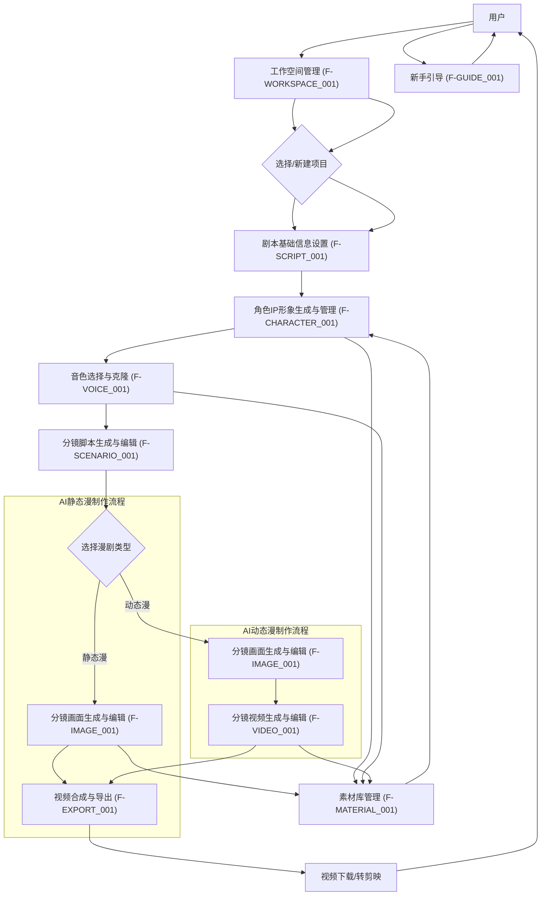
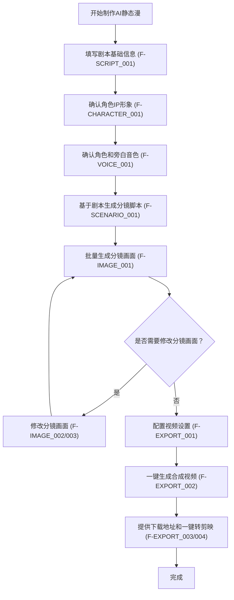
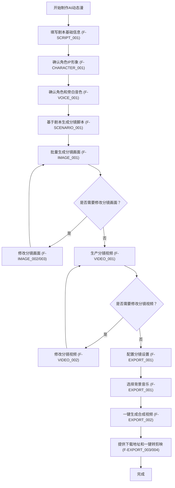
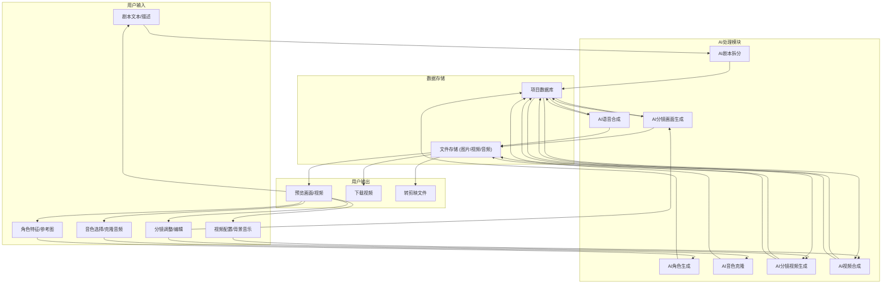

# 超AI漫剧工场产品需求文档

## 1. 产品概述

### 1.1 产品名称与定位

*   **产品名称:** AI漫剧快造
*   **产品定位:** 一款面向影视制作团队和自媒体创作者的Web端AI漫剧批量制作平台，旨在通过AI技术大幅提高动漫内容生产效率，降低动漫制作技术门槛。

### 1.2 产品应用语言

*   **产品应用语言:** 简体中文

### 1.3 产品愿景与目标

*   **产品愿景:** 成为AI漫剧制作领域的领导者，赋能创作者高效、高质量地生产动漫内容。
*   **产品目标:**
    *   提供一站式AI漫剧制作解决方案，覆盖从剧本到成片的全流程。
    *   通过AI自动化技术，将传统动漫制作周期缩短50%以上。
    *   降低用户对专业动漫制作技能的依赖，使非专业用户也能创作出高质量漫剧。
    *   支持AI静态漫和AI动态漫两种主流漫剧形式，满足不同用户需求。

### 1.4 产品使用终端

*   **主要终端:** Web端桌面应用
*   **浏览器支持:** Chrome 90+、Firefox 88+、Safari 14+、Edge 90+
*   **分辨率支持:** 768x480及以上分辨率，最佳体验为1920x1080
*   **响应式适配:** 支持768px以上的所有桌面和平板设备。

### 1.5 核心价值主张

*   **高效智能:** 利用AI技术自动化分镜生成、画面生成、视频合成等繁琐步骤，极大提升制作效率。
*   **降低门槛:** 简化复杂的动漫制作流程，用户无需深厚的美术或动画功底即可上手。
*   **灵活定制:** 提供丰富的定制选项，包括画风、角色、音色、背景音乐等，满足个性化创作需求。
*   **多格式输出:** 支持多种视频格式导出，并提供一键转剪映功能，方便用户进行后期处理。

### 1.6 目标用户群体分析

*   **影视制作团队:**
    *   **需求:** 快速制作动漫短剧、概念片、广告片等，降低制作成本，缩短项目周期。
    *   **痛点:** 传统动漫制作成本高、周期长，对专业人才依赖度高。
*   **自媒体创作者:**
    *   **需求:** 快速产出高质量动漫内容，吸引粉丝，增加流量。
    *   **痛点:** 缺乏专业制作团队和技能，难以持续产出优质动漫作品。

### 1.7 市场需求与竞品简析

*   **市场需求:** 随着短视频和内容消费的爆发式增长，对高质量、个性化动漫内容的需求日益旺盛。AI技术在内容创作领域的应用，为解决传统动漫制作效率低、成本高的问题提供了新的可能。
*   **竞品简析:**
    *   **传统动漫制作软件:** 如Toon Boom Harmony、Adobe Animate等，功能强大但操作复杂，学习成本高，不适合非专业用户。
    *   **AI绘画工具:** 如Midjourney、Stable Diffusion等，擅长图片生成，但缺乏完整的漫剧制作流程和视频合成能力。
    *   **部分AI视频生成工具:** 如Runway ML、Pika Labs等，专注于视频生成，但在漫剧剧本、分镜、角色IP等方面的集成度不高。
*   **本产品优势:** 超AI漫剧工场将AI绘画、AI视频生成、AI语音合成等技术深度整合，提供从剧本到成片的全链路AI漫剧制作能力，尤其在角色IP定制和分镜脚本AI拆分方面具有独特优势，形成差异化竞争。

### 1.8 浏览器兼容性要求

*   **桌面浏览器:**
    *   Google Chrome (最新2个稳定版本)
    *   Mozilla Firefox (最新2个稳定版本)
    *   Microsoft Edge (最新2个稳定版本)
    *   Apple Safari (最新2个稳定版本)
*   **最低分辨率:** 1280x768px
*   **推荐分辨率:** 1920x1080px 及以上

## 2. 功能规格

### 2.1 功能详述

#### 2.1.1 工作空间管理 (F-WORKSPACE_001)

| 功能ID | 功能名称 | 功能描述 | 优先级 |
|--------|---------|---------|--------|
| F-WORKSPACE_001 | 工作空间列表 | 展示所有可访问的工作空间，包括个人创建和被邀请的工作空间，支持按名称搜索。 | P0 |
| F-WORKSPACE_002 | 创建工作空间 | 提供创建新工作空间的入口，填写工作空间名称和描述。 | P0 |
| F-WORKSPACE_003 | 工作空间详情 | 展示工作空间的基本信息、成员列表和包含的项目。 | P0 |
| F-WORKSPACE_004 | 邀请成员 | 允许工作空间所有者邀请其他用户加入工作空间，设置成员权限。 | P0 |
| F-WORKSPACE_005 | 工作空间设置 | 允许工作空间所有者修改名称、描述，管理成员权限。 | P1 |
| F-WORKSPACE_006 | 退出工作空间 | 允许成员退出工作空间，所有者退出将触发工作空间转移或删除流程。 | P1 |

#### 2.1.2 项目管理 (F-PROJECT_001)

| 功能ID | 功能名称 | 功能描述 | 优先级 |
|--------|---------|---------|--------|
| F-PROJECT_001 | 项目列表 | 在当前工作空间内展示所有项目，支持按名称、类型、创建时间等进行搜索和筛选。 | P0 |
| F-PROJECT_002 | 新建项目 | 在当前工作空间内创建新项目，选择漫剧类型（AI静态漫/AI动态漫），并填写项目名称。 | P0 |
| F-PROJECT_003 | 项目详情 | 查看项目的基本信息、归属者、制作进度和各阶段成果预览。 | P0 |
| F-PROJECT_004 | 项目编辑 | 仅项目归属者可进入项目的任意制作阶段进行修改和调整。 | P0 |
| F-PROJECT_005 | 项目删除 | 仅项目归属者可删除项目。 | P1 |
| F-PROJECT_006 | 项目保存 | 自动保存项目进度，确保用户在任何阶段都不会丢失工作成果。 | P0 |
| F-PROJECT_007 | 项目拷贝 | 非归属者查看项目时可拷贝为新项目，成为新项目的归属者。 | P0 |
| F-PROJECT_008 | 项目权限管理 | 项目归属者可设置其他工作空间成员对该项目的权限（仅查看/可编辑）。 | P1 |

#### 2.1.2 剧本基础信息设置 (F-SCRIPT_001)

| 功能ID | 功能名称 | 功能描述 | 优先级 |
|--------|---------|---------|--------|
| F-SCRIPT_001 | 填写剧本信息 | 用户输入漫剧名称、选择画风（文本描述或参考图上传）、选择视频比例和分辨率。 | P0 |
| F-SCRIPT_002 | 故事背景描述 | 用户输入漫剧的故事背景，为AI生成提供上下文。 | P0 |
| F-SCRIPT_003 | 画风选择 | 提供文本输入框供用户描述画风，或提供上传参考图的功能，AI将根据输入生成符合风格的内容。 | P0 |

#### 2.1.3 角色IP形象生成与管理 (F-CHARACTER_001)

| 功能ID | 功能名称 | 功能描述 | 优先级 |
|--------|---------|---------|--------|
| F-CHARACTER_001 | 文本描述生成角色 | 用户输入角色特征描述（如外貌、性格、服装等），AI生成角色形象IP（三张不同视角的立绘）。 | P0 |
| F-CHARACTER_002 | 参考图上传生成角色 | 用户上传参考图片，AI根据参考图风格和用户输入的特征描述生成角色形象IP。 | P0 |
| F-CHARACTER_003 | 提示词修改与重新生成 | 用户可以直接修改AI生成角色时使用的提示词，或上传新的参考图，重新生成角色形象。 | P0 |
| F-CHARACTER_004 | 多视角生成 | 确保生成的角色立绘包含正面、侧面、45度角等多个视角，便于后续分镜使用。 | P0 |
| F-CHARACTER_005 | 形象保存与复用 | 用户可以将满意的角色形象保存到素材库，方便在其他项目中复用。 | P0 |
| F-CHARACTER_006 | 手动上传自定义形象 | 用户可以直接上传自己绘制或获取的角色立绘图，跳过AI生成步骤。 | P0 |

#### 2.1.4 音色选择与克隆 (F-VOICE_001)

| 功能ID | 功能名称 | 功能描述 | 优先级 |
|--------|---------|---------|--------|
| F-VOICE_001 | 音色列表选择 | 提供多种预设的角色和旁白音色供用户选择。 | P0 |
| F-VOICE_002 | 音色效果试听 | 用户可以试听所选音色的效果，以便做出最佳选择。 | P0 |
| F-VOICE_003 | 音色克隆 | 用户上传音频文件（如特定人的声音），AI进行音色克隆，生成独特的定制音色。 | P0 |
| F-VOICE_004 | 音频参数设置 | 设置默认的音频速率、音调等参数，影响最终语音合成效果。 | P1 |

#### 2.1.5 分镜脚本生成与编辑 (F-SCENARIO_001)

| 功能ID | 功能名称 | 功能描述 | 优先级 |
|--------|---------|---------|--------|
| F-SCENARIO_001 | AI自动拆分剧本 | 用户输入完整剧本，AI自动将其拆分成一系列分镜描述脚本，包含关联角色、画面描述、旁白、对话等。 | P0 |
| F-SCENARIO_002 | 分镜增删 | 用户可以手动增加或删除分镜，以调整故事节奏。 | P0 |
| F-SCENARIO_003 | 分镜顺序调整 | 用户可以拖拽或通过上下移动按钮调整分镜的播放顺序。 | P0 |
| F-SCENARIO_004 | 分镜描述修改 | 用户可以编辑每个分镜的画面描述，使其更符合预期。 | P0 |
| F-SCENARIO_005 | 角色关联 | 每个分镜可以关联一个或多个已创建的角色IP形象。 | P0 |
| F-SCENARIO_006 | 旁白与对话编辑 | 用户可以编辑每个分镜的旁白和角色对话内容。 | P0 |

#### 2.1.6 分镜画面生成与编辑 (F-IMAGE_001)

| 功能ID | 功能名称 | 功能描述 | 优先级 |
|--------|---------|---------|--------|
| F-IMAGE_001 | 批量生成分镜画面 | 用户点击按钮，AI根据分镜脚本批量生成所有分镜的画面图片。生成过程中提供进度通知。 | P0 |
| F-IMAGE_002 | 单个分镜画面修改 | 用户可以针对每个分镜的画面进行单独修改，包括：1.修改关联角色；2.修改分镜提示词描述；3.重新生成该分镜画面 | P0 |
| F-IMAGE_003 | 分镜画面独立工作流修改 | 提供一个独立的工作流界面（类似loveart的对话方式），用户可以与AI进行多轮交互，精细调整单个分镜画面。 | P0 |

#### 2.1.7 分镜视频生成与编辑 (F-VIDEO_001)

| 功能ID | 功能名称 | 功能描述 | 优先级 |
|--------|---------|---------|--------|
| F-VIDEO_001 | 批量生成分镜视频 | 用户点击按钮，AI根据分镜画面图片和视频提示词（主体、动作、运镜）批量生成分镜视频。生成过程中提供进度通知。 | P0 |
| F-VIDEO_002 | 单个分镜视频修改 | 用户可以针对每个分镜的视频进行单独修改，包括：1.修改分镜画面图片；2.修改视频提示词（主体、动作、运镜）；3.重新生成该分镜视频 | P0 |
| F-VIDEO_003 | 分镜视频试播放 | 生成后，用户可以点击播放按钮，预览单个分镜视频效果。 | P0 |

#### 2.1.8 视频合成与导出 (F-EXPORT_001)

| 功能ID | 功能名称 | 功能描述 | 优先级 |
|--------|---------|---------|--------|
| F-EXPORT_001 | 配置视频设置 | 用户选择背景音乐、字幕样式、转场效果等，配置最终合成视频的整体风格。 | P0 |
| F-EXPORT_002 | 一键生成合成视频 | 用户点击按钮，系统根据所有分镜内容和配置，合成最终的完整漫剧视频。 | P0 |
| F-EXPORT_003 | 视频下载 | 提供合成视频的下载地址，支持多种常见视频格式（如MP4）。 | P0 |
| F-EXPORT_004 | 一键转剪映 | 提供将合成视频项目文件直接导出到剪映的功能，方便用户进行更精细的后期剪辑。 | P0 |

#### 2.1.9 素材库管理 (F-MATERIAL_001)

| 功能ID | 功能名称 | 功能描述 | 优先级 |
|--------|---------|---------|--------|
| F-MATERIAL_001 | 素材分类管理 | 支持对图片、音频、视频等素材进行分类管理，方便查找和复用。 | P1 |
| F-MATERIAL_002 | 素材上传与删除 | 用户可以上传本地素材到素材库，也可以删除不再需要的素材。 | P1 |
| F-MATERIAL_003 | 素材预览 | 提供素材的缩略图和预览功能，方便用户快速识别素材内容。 | P1 |

#### 2.1.10 新手引导 (F-GUIDE_001)

| 功能ID | 功能名称 | 功能描述 | 优先级 |
|--------|---------|---------|--------|
| F-GUIDE_001 | 首次使用引导 | 新用户首次登录时，提供交互式引导，介绍产品核心功能和操作流程。 | P1 |
| F-GUIDE_002 | 功能提示 | 在关键功能点提供工具提示或帮助文档链接，辅助用户理解和操作。 | P1 |

### 2.2 功能模块间的关系图

## 3. 用户流程

### 3.1 用户旅程地图

| 阶段 | 用户目标 | 用户行为 | 系统响应 | 痛点/机遇 | 情绪 |
|---|---|---|---|---|---|
| **启动** | 了解产品，开始制作 | 访问网站，注册/登录，浏览新手引导 | 展示产品介绍，提供注册/登录入口，引导用户了解核心功能 | 对AI工具陌生，担心操作复杂 | 期待，好奇 |
| **项目创建** | 开始新项目 | 点击“新建项目”，选择漫剧类型（AI静态漫、AI动态漫），填写项目名称 | 创建项目，进入制作流程第一步 | 不知如何开始，选择困难 | 兴奋，略有迷茫 |
| **剧本与角色设定** | 定义漫剧内容和风格 | 填写剧本信息，描述画风，创建/上传角色，选择/克隆音色 | AI生成初步内容，提供编辑界面 | 角色形象不符预期，音色选择困难 | 专注，调整 |
| **分镜生成与编辑** | 细化故事内容 | 输入剧本，AI拆分，手动调整分镜，编辑画面描述 | 生成分镜脚本，提供可视化编辑界面 | 分镜拆分不合理，画面描述不精准 | 细致，修改 |
| **画面/视频生成** | 生成视觉内容 | 批量生成分镜画面/视频，预览，单独修改 | 后台处理，显示进度，提供预览和修改入口 | 生成效果不佳，修改耗时 | 等待，期待，调整 |
| **视频合成与导出** | 完成作品并分享 | 配置视频设置，选择背景音乐，合成视频，下载或转剪映 | 合成视频，提供下载链接和导出选项 | 合成时间长，导出格式不兼容 | 满意，轻松 |
| **项目管理** | 管理和复用项目 | 查看项目列表，编辑旧项目，删除项目 | 展示项目列表，提供项目操作入口 | 项目过多难以管理，素材复用不便 | 有序，高效 |

### 3.2 关键业务流程图

#### 3.2.1 AI静态漫制作流程

#### 3.2.2 AI动态漫制作流程

### 3.3 各场景下的用户操作步骤

#### 3.3.1 场景一：创建新项目并完成AI静态漫制作

1.  **用户操作:** 访问超AI漫剧工场网站，点击“注册/登录”按钮，完成账号登录。
2.  **用户操作:** 在项目管理页（P-PROJECT_LIST）点击“新建项目”按钮。
3.  **用户操作:** 在新建项目弹窗中，选择“AI静态漫”类型，输入项目名称“我的第一个AI漫剧”，点击“确定”。
4.  **系统响应:** 系统创建新项目，并自动跳转至剧本基础信息设置页（P-SCRIPT_INFO）。
5.  **用户操作:** 在剧本基础信息设置页（P-SCRIPT_INFO）填写漫剧名称、选择画风（文本输入“日系二次元”）、选择视频比例“16:9”和分辨率“1080P”，输入故事背景。点击“下一步”。
6.  **系统响应:** 系统保存剧本信息，并跳转至角色IP形象生成页（P-CHARACTER_GENERATION）。
7.  **用户操作:** 在角色IP形象生成页（P-CHARACTER_GENERATION），点击“新建角色”，输入角色特征描述“一个穿着蓝色连衣裙的少女，长发，大眼睛”，点击“生成”。AI生成三张不同视角的角色立绘。用户对生成结果满意，点击“保存角色”。点击“下一步”。
8.  **系统响应:** 系统保存角色信息，并跳转至音色选择与克隆页（P-VOICE_SELECTION）。
9.  **用户操作:** 在音色选择与克隆页（P-VOICE_SELECTION），试听不同的角色音色和旁白音色，选择一个少女音色作为角色音，一个沉稳音色作为旁白音。点击“下一步”。
10. **系统响应:** 系统保存音色设置，并跳转至分镜脚本生成与编辑页（P-SCENARIO_EDITOR）。
11. **用户操作:** 在分镜脚本生成与编辑页（P-SCENARIO_EDITOR），粘贴完整剧本内容，点击“AI拆分分镜”按钮。AI自动将剧本拆分成多个分镜脚本。用户检查分镜，对部分分镜的画面描述进行修改，并调整了两个分镜的顺序。点击“下一步”。
12. **系统响应:** 系统保存分镜脚本，并跳转至分镜画面生成与编辑页（P-IMAGE_GENERATION）。
13. **用户操作:** 在分镜画面生成与编辑页（P-IMAGE_GENERATION），点击“批量生成分镜画面”按钮。系统开始后台处理，并在页面顶部显示进度通知。生成完成后，用户预览所有分镜画面，发现其中一个画面不满意，点击该分镜的“修改”按钮，进入独立工作流界面，通过对话方式让AI重新生成，直到满意为止。点击“下一步”。
14. **系统响应:** 系统保存分镜画面，并跳转至视频合成与导出页（P-VIDEO_EXPORT）。
15. **用户操作:** 在视频合成与导出页（P-VIDEO_EXPORT），选择一首背景音乐，选择默认字幕样式，点击“一键生成合成视频”按钮。系统开始合成视频，并显示进度。
16. **系统响应:** 视频合成完成后，页面显示视频预览播放器、下载按钮和“一键转剪映”按钮。
17. **用户操作:** 用户点击“下载”按钮，将视频保存到本地。

#### 3.3.2 场景二：修改已有的AI动态漫项目

1.  **用户操作:** 登录后，在项目管理页（P-PROJECT_LIST）找到之前创建的“我的动态漫项目”，点击“编辑”按钮。
2.  **系统响应:** 系统加载项目，并跳转至该项目的剧本基础信息设置页（P-SCRIPT_INFO）。
3.  **用户操作:** 用户发现故事背景需要调整，修改故事背景描述，点击“下一步”。
4.  **系统响应:** 系统保存修改，并跳转至角色IP形象生成页（P-CHARACTER_GENERATION）。
5.  **用户操作:** 用户决定更换主角形象，点击主角旁边的“修改”按钮，重新输入角色特征描述并上传一张参考图，点击“重新生成”。AI生成新的角色立绘，用户满意后点击“保存角色”。点击“下一步”。
6.  **系统响应:** 系统保存角色修改，并跳转至音色选择与克隆页（P-VOICE_SELECTION）。
7.  **用户操作:** 用户决定克隆一个新的旁白音色，点击“克隆音色”，上传一段音频文件，等待AI克隆完成。试听后满意，点击“下一步”。
8.  **系统响应:** 系统保存音色修改，并跳转至分镜脚本生成与编辑页（P-SCENARIO_EDITOR）。
9.  **用户操作:** 用户发现某个分镜的对话需要修改，直接在分镜列表中编辑该分镜的对话内容。点击“下一步”。
10. **系统响应:** 系统保存分镜脚本修改，并跳转至分镜画面生成与编辑页（P-IMAGE_GENERATION）。
11. **用户操作:** 用户发现由于角色形象改变，之前生成的分镜画面需要更新，点击“批量生成分镜画面”按钮，重新生成所有画面。生成完成后，点击“下一步”。
12. **系统响应:** 系统保存分镜画面，并跳转至分镜视频生成与编辑页（P-VIDEO_GENERATION）。
13. **用户操作:** 用户发现某个分镜视频的运镜效果不佳，点击该分镜的“修改”按钮，调整视频提示词中的“运镜”部分，点击“重新生成”。预览后满意，点击“下一步”。
14. **系统响应:** 系统保存分镜视频修改，并跳转至视频合成与导出页（P-VIDEO_EXPORT）。
15. **用户操作:** 用户选择一个新的背景音乐，点击“一键生成合成视频”按钮。
16. **系统响应:** 视频合成完成后，用户点击“一键转剪映”按钮，将项目文件导出到剪映进行进一步剪辑。

## 4. 数据流设计

### 4.1 数据结构与关系

*   **用户 (User):**
    *   `user_id` (PK)
    *   `username`
    *   `email`
    *   `password_hash`
    *   `created_at`
    *   `last_login_at`
*   **工作空间 (Workspace):**
    *   `workspace_id` (PK)
    *   `workspace_name`
    *   `description`
    *   `owner_id` (FK to User)
    *   `created_at`
    *   `updated_at`
*   **项目 (Project):**
    *   `project_id` (PK)
    *   `workspace_id` (FK to Workspace)
    *   `owner_id` (FK to User)
    *   `user_id` (FK to User)  <!-- 兼容历史数据 -->
    *   `project_name`
    *   `project_type` (AI静态漫/AI动态漫)
    *   `status` (进行中/已完成/草稿)
    *   `created_at`
    *   `updated_at`
*   **剧本信息 (ScriptInfo):**
    *   `script_id` (PK)
    *   `project_id` (FK to Project)
    *   `drama_name`
    *   `style_type` (文本/参考图)
    *   `style_text`
    *   `style_image_url`
    *   `aspect_ratio`
    *   `resolution`
    *   `story_background`
*   **角色 (Character):**
    *   `character_id` (PK)
    *   `project_id` (FK to Project)
    *   `character_name`
    *   `description`
    *   `reference_image_url`
    *   `generated_image_urls` (JSON array of URLs for different angles)
    *   `is_custom_upload` (Boolean)
    *   `custom_image_urls` (JSON array of URLs)
*   **音色 (Voice):**
    *   `voice_id` (PK)
    *   `project_id` (FK to Project)
    *   `voice_type` (角色/旁白)
    *   `voice_name`
    *   `voice_source` (预设/克隆)
    *   `clone_audio_url`
    *   `default_speed`
    *   `default_pitch`
*   **分镜脚本 (Scenario):**
    *   `scenario_id` (PK)
    *   `project_id` (FK to Project)
    *   `order_index`
    *   `shot_description`
    *   `narrator_text`
    *   `dialogue_text`
    *   `related_character_ids` (JSON array of Character IDs)
*   **分镜画面 (ShotImage):**
    *   `shot_image_id` (PK)
    *   `scenario_id` (FK to Scenario)
    *   `image_url`
    *   `generation_prompt`
    *   `status` (生成中/已完成/失败)
*   **分镜视频 (ShotVideo):**
    *   `shot_video_id` (PK)
    *   `scenario_id` (FK to Scenario)
    *   `video_url`
    *   `generation_prompt_subject`
    *   `generation_prompt_action`
    *   `generation_prompt_camera`
    *   `status` (生成中/已完成/失败)
*   **视频合成配置 (VideoExportConfig):**
    *   `config_id` (PK)
    *   `project_id` (FK to Project)
    *   `background_music_url`
    *   `subtitle_style_id` (FK to SubtitleStyle)
    *   `transition_effect_id` (FK to TransitionEffect)
*   **最终视频 (FinalVideo):**
    *   `final_video_id` (PK)
    *   `project_id` (FK to Project)
    *   `video_url`
    *   `export_format`
    *   `export_status` (生成中/已完成/失败)
    *   `export_time`
*   **素材 (Material):**
    *   `material_id` (PK)
    *   `user_id` (FK to User)
    *   `material_type` (图片/音频/视频)
    *   `material_url`
    *   `material_name`
    *   `category`
    *   `uploaded_at`

### 4.2 关键数据流向图

### 4.3 数据存储与处理原则

1.  **数据安全:**
    *   用户敏感信息（如密码）进行加密存储。
    *   所有数据传输采用HTTPS加密协议。
    *   定期进行数据备份，确保数据可恢复性。
    *   严格的访问控制，只有授权人员和系统服务才能访问生产数据。
2.  **数据一致性:**
    *   采用事务管理，确保多步骤操作的数据原子性。
    *   项目状态与各阶段数据保持同步，避免数据不一致。
3.  **数据可扩展性:**
    *   数据库设计考虑未来功能扩展，采用范式化设计。
    *   文件存储采用云存储服务，支持弹性扩容。
4.  **数据处理:**
    *   AI生成任务采用异步处理，避免阻塞用户界面。
    *   生成任务状态实时更新，通过通知机制反馈给用户。
    *   对于大文件（如视频），采用分片上传和下载机制。
5.  **数据复用:**
    *   角色、音色、素材等可复用资源独立存储，方便跨项目使用。
    *   提供素材库管理功能，方便用户查找和管理已上传资源。

## 5. 页面规格

### 5.1 页面概览

#### 5.1.1 整体布局架构

*   **布局模式:** Web端响应式布局 - 固定顶部导航栏 + 左侧菜单 + 主内容区。
*   **空间分配策略:**
    *   **顶部导航栏:** 高度60px，固定定位，包含Logo、主要导航链接、用户操作区。
    *   **左侧菜单:** 宽度200-240px（展开）/48-56px（折叠），固定定位，提供功能模块导航。
    *   **主内容区:** 动态宽度，占据剩余空间，最小宽度720px。
    *   **右侧面板:** **严格限制使用**，仅在屏幕宽度≥1440px且功能确实必要时使用，宽度280-320px。必须在布局中占据独立空间，绝对不能浮动遮挡主内容区，且需确保主内容区宽度≥720px。
*   **导航体系:** 顶部主导航（用户相关、全局搜索）+ 左侧功能菜单（项目、制作流程、素材库）+ 面包屑导航（在主内容区顶部）。
*   **交互模式:** 页面切换（通过左侧菜单或顶部导航）、模态弹窗（用于表单提交、确认操作）、侧边抽屉（用于详情查看）、右键菜单（用于快捷操作）。

#### 5.1.2 页面列表

| 页面ID | 页面名称 | 核心功能 | 布局类型 | 右侧面板 |
|--------|---------|---------|---------|---------|
| P-LOGIN | 登录页 | 用户登录 | 单栏居中 | 不使用 |
| P-REGISTER | 注册页 | 用户注册 | 单栏居中 | 不使用 |
| P-WORKSPACE_LIST | 工作空间列表页 | 工作空间列表、创建、切换、成员管理 | 二栏布局 | 不使用 |
| P-WORKSPACE_DETAIL | 工作空间详情页 | 工作空间信息、成员管理、设置 | 二栏布局 | 不使用 |
| P-PROJECT_LIST | 项目管理页 | 项目列表、新建、编辑、删除、拷贝 | 二栏布局 | 不使用 |
| P-SCRIPT_INFO | 剧本基础信息设置页 | 填写剧本名称、画风、比例、分辨率、故事背景 | 二栏布局 | 不使用 |
| P-CHARACTER_GENERATION | 角色IP形象生成页 | 角色创建、AI生成、修改、上传 | 二栏布局 | 不使用 |
| P-VOICE_SELECTION | 音色选择与克隆页 | 音色选择、试听、克隆、参数设置 | 二栏布局 | 不使用 |
| P-SCENARIO_EDITOR | 分镜脚本生成与编辑页 | AI拆分剧本、分镜增删改查、顺序调整 | 二栏布局 | 不使用 |
| P-IMAGE_GENERATION | 分镜画面生成与编辑页 | 批量生成分镜画面、单张修改、独立工作流 | 二栏布局 | 不使用 |
| P-VIDEO_GENERATION | 分镜视频生成与编辑页 | 批量生成分镜视频、单张修改、试播放 | 二栏布局 | 不使用 |
| P-VIDEO_EXPORT | 视频合成与导出页 | 配置视频设置、合成视频、下载、转剪映 | 二栏布局 | 不使用 |
| P-MATERIAL_LIBRARY | 素材库管理页 | 素材上传、分类、预览、删除 | 二栏布局 | 不使用 |

### 5.2 页面详情

#### 5.2.1 登录页（P-LOGIN）

**布局架构设计：**
- 页面类型：认证页面
- 布局模式：单栏居中布局
- 空间分配：页面主体内容（登录表单）垂直居中，背景为产品宣传图或纯色。

**页面布局架构：**
- 顶部导航栏：无
- 左侧菜单：无
- 主内容区域：
  - 登录表单：包含用户名/邮箱输入框、密码输入框、登录按钮、忘记密码链接、注册链接。
  - 产品Logo和名称。
- 右侧面板：无

**响应式适配策略：**
- 大屏幕(≥1440px)：登录表单居中显示，宽度限制在400-500px。
- 中屏幕(1200-1439px)：登录表单居中显示，宽度限制在400-500px。
- 小屏幕(768-1199px)：登录表单居中显示，宽度自适应，最大宽度500px。
- 移动端(<768px)：登录表单全屏宽度显示，上下边距保留。

**组件尺寸规范：**
- 按钮尺寸：登录按钮高度40px，宽度自适应表单宽度。
- 输入框：高度40px，宽度自适应表单宽度。
- 间距规范：输入框间距16px，按钮与输入框间距24px。

**核心功能：**
用户登录认证。

#### 5.2.2 注册页（P-REGISTER）

**布局架构设计：**
- 页面类型：认证页面
- 布局模式：单栏居中布局
- 空间分配：页面主体内容（注册表单）垂直居中，背景为产品宣传图或纯色。

**页面布局架构：**
- 顶部导航栏：无
- 左侧菜单：无
- 主内容区域：
  - 注册表单：包含用户名输入框、邮箱输入框、密码输入框、确认密码输入框、注册按钮、已有账号登录链接。
  - 产品Logo和名称。
- 右侧面板：无

**响应式适配策略：**
- 大屏幕(≥1440px)：注册表单居中显示，宽度限制在400-500px。
- 中屏幕(1200-1439px)：注册表单居中显示，宽度限制在400-500px。
- 小屏幕(768-1199px)：注册表单居中显示，宽度自适应，最大宽度500px。
- 移动端(<768px)：注册表单全屏宽度显示，上下边距保留。

**组件尺寸规范：**
- 按钮尺寸：注册按钮高度40px，宽度自适应表单宽度。
- 输入框：高度40px，宽度自适应表单宽度。
- 间距规范：输入框间距16px，按钮与输入框间距24px。

**核心功能：**
用户注册。

#### 5.2.3 工作空间列表页（P-WORKSPACE_LIST）

**布局架构设计：**
- 页面类型：列表管理页
- 布局模式：二栏布局
- 空间分配：顶部导航栏 + 左侧菜单 + 主内容区。

**页面布局架构：**
- 顶部导航栏：Logo、全局搜索框、消息通知、用户头像 - 高度60px，固定定位。
- 左侧菜单：功能导航菜单（工作空间、素材库、帮助中心），当前选中"工作空间"，支持折叠 - 宽度200-240px(展开)/48-56px(折叠)。
- 主内容区域：核心展示区域，最小宽度720px。
  - 页面头部：页面标题"工作空间管理"、面包屑导航（首页 > 工作空间）、主要操作按钮组（"创建工作空间"按钮） - 高度48-60px。
  - 内容展示区域：工作空间列表，以卡片形式展示，包含工作空间名称、描述、项目数量、成员数量、操作按钮（进入/设置/退出） - 自适应高度。
- 右侧面板：不使用。

**响应式适配策略：**
- 大屏幕(≥1440px)：二栏布局，左侧240px + 主内容区充满剩余空间，工作空间卡片可多列布局。
- 中屏幕(1200-1439px)：二栏布局，左侧240px + 主内容区充满剩余空间，工作空间卡片可两列布局。
- 小屏幕(768-1199px)：左侧菜单折叠或抽屉式，主内容区充满剩余空间，工作空间卡片单列布局。
- 移动端(<768px)：单栏布局，左侧菜单抽屉式，工作空间卡片单列布局。

**组件尺寸规范：**
- 按钮尺寸：创建工作空间按钮高度40px，列表内操作按钮高度32px。
- 工作空间卡片：高度180-220px，宽度自适应列数。
- 间距规范：组件间距12-16px，区域间距20px。

**核心功能：**
工作空间列表展示、创建、进入、设置、退出。

**数据结构：**
| 列名 | 数据类型 | 宽度建议 | 是否可排序 | 操作功能 |
|------|---------|----------|----------|---------|
| 工作空间名称 | 文本 | 200px | 是 | 点击进入工作空间 |
| 项目数量 | 数字 | 80px | 是 | - |
| 成员数量 | 数字 | 80px | 是 | - |
| 创建时间 | 日期时间 | 150px | 是 | 排序 |
| 操作 | 操作按钮组 | 150px | 否 | 进入/设置/退出 |

#### 5.2.4 项目管理页（P-PROJECT_LIST）

**布局架构设计：**
- 页面类型：列表管理页
- 布局模式：二栏布局
- 空间分配：顶部导航栏 + 左侧菜单 + 主内容区。

**页面布局架构：**
- 顶部导航栏：Logo、全局搜索框、消息通知、用户头像 - 高度60px，固定定位。
- 左侧菜单：功能导航菜单（项目管理、素材库、帮助中心），当前选中“项目管理”，支持折叠 - 宽度200-240px(展开)/48-56px(折叠)。
- 主内容区域：核心展示区域，最小宽度720px。
  - 页面头部：页面标题“项目管理”、面包屑导航（首页 > [工作空间名称] > 项目管理）、主要操作按钮组（“新建项目”按钮） - 高度48-60px。
  - 工作空间信息栏：显示当前工作空间名称、成员数量，提供切换工作空间和管理工作空间入口 - 高度40px。
  - 工具栏区域：搜索框（按项目名称搜索）、筛选条件（按项目类型、状态筛选）、排序选项 - 高度40-48px。
  - 内容展示区域：项目列表，以卡片或表格形式展示，包含项目名称、类型、创建时间、状态、操作按钮（编辑、删除、预览） - 自适应高度。
  - 分页区域：分页控件，显示总数、每页条数选择、跳转功能 - 高度40px，右对齐。
- 右侧面板：不使用。

**响应式适配策略：**
- 大屏幕(≥1440px)：二栏布局，左侧240px + 主内容区充满剩余空间。
- 中屏幕(1200-1439px)：二栏布局，左侧240px + 主内容区充满剩余空间。
- 小屏幕(768-1199px)：左侧菜单折叠或抽屉式，主内容区充满剩余空间，项目列表可调整为单列或两列卡片布局。
- 移动端(<768px)：单栏布局，左侧菜单抽屉式，项目列表单列卡片布局。

**组件尺寸规范：**
- 按钮尺寸：新建项目按钮高度40px，列表内操作按钮高度32px。
- 输入框：搜索框高度36px。
- 表格行高：40px（如果使用表格）。
- 卡片尺寸：高度180-220px，宽度自适应列数。
- 间距规范：组件间距12-16px，区域间距20px。

**核心功能：**
项目列表展示、搜索、筛选、新建、编辑、删除、预览、拷贝。
- 项目归属者可进行所有操作
- 非归属者仅可查看和拷贝项目
- 拷贝项目生成新项目，当前用户成为新项目归属者

**数据结构：**
| 列名 | 数据类型 | 宽度建议 | 是否可排序 | 操作功能 |
|------|---------|----------|----------|---------|
| 项目名称 | 文本 | 200px | 是 | 点击进入项目详情 |
| 项目类型 | 标签 | 100px | 是 | 筛选 |
| 创建时间 | 日期时间 | 150px | 是 | 排序 |
| 状态 | 标签 | 80px | 是 | 筛选 |
| 操作 | 操作按钮组 | 150px | 否 | 编辑/删除/预览 |

#### 5.2.4 剧本基础信息设置页（P-SCRIPT_INFO）

**布局架构设计：**
- 页面类型：表单页
- 布局模式：二栏布局
- 空间分配：顶部导航栏 + 左侧菜单 + 主内容区。

**页面布局架构：**
- 顶部导航栏：Logo、全局搜索框、消息通知、用户头像 - 高度60px，固定定位。
- 左侧菜单：功能导航菜单（项目管理、制作流程、素材库），当前选中“制作流程”下的“剧本信息”，支持折叠 - 宽度200-240px(展开)/48-56px(折叠)。
- 主内容区域：核心展示区域，最小宽度720px。
  - 页面头部：页面标题“剧本基础信息”、面包屑导航（项目管理 > [项目名称] > 剧本基础信息）、主要操作按钮组（“保存”、“下一步”按钮） - 高度48-60px。
  - 内容展示区域：表单区域，包含：
    - 漫剧名称输入框
    - 画风选择（单选：文本描述/参考图上传）
    - 画风文本描述输入框（根据选择显示）
    - 画风参考图上传区域（根据选择显示）
    - 视频比例选择（下拉框）
    - 分辨率选择（下拉框）
    - 故事背景文本域
  - 底部操作区：包含“上一步”、“保存”、“下一步”按钮。
- 右侧面板：不使用。

**响应式适配策略：**
- 大屏幕(≥1440px)：二栏布局，左侧240px + 主内容区充满剩余空间。
- 中屏幕(1200-1439px)：二栏布局，左侧240px + 主内容区充满剩余空间。
- 小屏幕(768-1199px)：左侧菜单折叠或抽屉式，主内容区充满剩余空间，表单元素垂直排列。
- 移动端(<768px)：单栏布局，左侧菜单抽屉式，表单元素垂直排列。

**组件尺寸规范：**
- 按钮尺寸：下一步/保存按钮高度40px。
- 输入框：高度40px，文本域高度120-160px。
- 间距规范：表单项间距16-24px。

**核心功能：**
填写和修改漫剧的基本信息和风格设定。

#### 5.2.5 角色IP形象生成页（P-CHARACTER_GENERATION）

**布局架构设计：**
- 页面类型：编辑页
- 布局模式：二栏布局
- 空间分配：顶部导航栏 + 左侧菜单 + 主内容区。

**页面布局架构：**
- 顶部导航栏：Logo、全局搜索框、消息通知、用户头像 - 高度60px，固定定位。
- 左侧菜单：功能导航菜单（项目管理、制作流程、素材库），当前选中“制作流程”下的“角色IP形象”，支持折叠 - 宽度200-240px(展开)/48-56px(折叠)。
- 主内容区域：核心展示区域，最小宽度720px。
  - 页面头部：页面标题“角色IP形象”、面包屑导航（项目管理 > [项目名称] > 角色IP形象）、主要操作按钮组（“新建角色”、“保存”、“下一步”按钮） - 高度48-60px。
  - 内容展示区域：
    - 角色列表：以卡片形式展示已创建角色，每张卡片包含角色名称、缩略图、编辑/删除按钮。
    - 角色编辑/创建区域：当点击“新建角色”或“编辑”按钮时，显示表单：
      - 角色名称输入框
      - 角色特征描述文本域
      - 参考图上传区域
      - “生成”按钮
      - 生成结果预览区（显示三张不同视角的立绘）
      - “重新生成”、“保存角色”按钮
      - “手动上传自定义形象”入口
  - 底部操作区：包含“上一步”、“保存”、“下一步”按钮。
- 右侧面板：不使用。

**响应式适配策略：**
- 大屏幕(≥1440px)：二栏布局，左侧240px + 主内容区充满剩余空间，角色卡片可多列布局。
- 中屏幕(1200-1439px)：二栏布局，左侧240px + 主内容区充满剩余空间，角色卡片可两列布局。
- 小屏幕(768-1199px)：左侧菜单折叠或抽屉式，主内容区充满剩余空间，角色卡片单列布局。
- 移动端(<768px)：单栏布局，左侧菜单抽屉式，角色卡片单列布局。

**组件尺寸规范：**
- 按钮尺寸：新建角色/下一步/保存按钮高度40px，生成/重新生成按钮高度36px。
- 输入框：高度40px，文本域高度120-160px。
- 角色卡片：高度200-250px，宽度自适应列数。
- 间距规范：角色卡片间距16px，表单项间距16-24px。

**核心功能：**
创建、编辑、删除角色IP形象，支持AI生成和手动上传。

#### 5.2.6 音色选择与克隆页（P-VOICE_SELECTION）

**布局架构设计：**
- 页面类型：编辑页
- 布局模式：二栏布局
- 空间分配：顶部导航栏 + 左侧菜单 + 主内容区。

**页面布局架构：**
- 顶部导航栏：Logo、全局搜索框、消息通知、用户头像 - 高度60px，固定定位。
- 左侧菜单：功能导航菜单（项目管理、制作流程、素材库），当前选中“制作流程”下的“音色选择”，支持折叠 - 宽度200-240px(展开)/48-56px(折叠)。
- 主内容区域：核心展示区域，最小宽度720px。
  - 页面头部：页面标题“音色选择与克隆”、面包屑导航（项目管理 > [项目名称] > 音色选择与克隆）、主要操作按钮组（“保存”、“下一步”按钮） - 高度48-60px。
  - 内容展示区域：
    - 角色音色选择区：列表展示预设角色音色，每个音色包含名称、试听按钮、选择按钮。
    - 旁白音色选择区：列表展示预设旁白音色，每个音色包含名称、试听按钮、选择按钮。
    - 音色克隆区：包含“上传音频文件”按钮、克隆进度显示、克隆结果试听、“使用克隆音色”按钮。
    - 音频参数设置区：包含速率、音调等滑块或输入框。
  - 底部操作区：包含“上一步”、“保存”、“下一步”按钮。
- 右侧面板：不使用。

**响应式适配策略：**
- 大屏幕(≥1440px)：二栏布局，左侧240px + 主内容区充满剩余空间，音色列表可多列布局。
- 中屏幕(1200-1439px)：二栏布局，左侧240px + 主内容区充满剩余空间，音色列表可两列布局。
- 小屏幕(768-1199px)：左侧菜单折叠或抽屉式，主内容区充满剩余空间，音色列表单列布局。
- 移动端(<768px)：单栏布局，左侧菜单抽屉式，音色列表单列布局。

**组件尺寸规范：**
- 按钮尺寸：下一步/保存按钮高度40px，试听/选择按钮高度32px。
- 输入框：高度40px。
- 间距规范：音色列表项间距12px，区域间距24px。

**核心功能：**
选择预设音色、克隆自定义音色、设置音频参数。

#### 5.2.7 分镜脚本生成与编辑页（P-SCENARIO_EDITOR）

**布局架构设计：**
- 页面类型：编辑页
- 布局模式：二栏布局
- 空间分配：顶部导航栏 + 左侧菜单 + 主内容区。

**页面布局架构：**
- 顶部导航栏：Logo、全局搜索框、消息通知、用户头像 - 高度60px，固定定位。
- 左侧菜单：功能导航菜单（项目管理、制作流程、素材库），当前选中“制作流程”下的“分镜脚本”，支持折叠 - 宽度200-240px(展开)/48-56px(折叠)。
- 主内容区域：核心展示区域，最小宽度720px。
  - 页面头部：页面标题“分镜脚本生成与编辑”、面包屑导航（项目管理 > [项目名称] > 分镜脚本生成与编辑）、主要操作按钮组（“AI拆分分镜”、“保存”、“下一步”按钮） - 高度48-60px。
  - 内容展示区域：
    - 剧本输入区：文本域，用于粘贴完整剧本。
    - 分镜列表区：以卡片或列表形式展示AI拆分后的分镜，每个分镜包含：
      - 分镜ID
      - 画面描述（可编辑）
      - 关联角色（可选择）
      - 旁白（可编辑）
      - 对话（可编辑）
      - 操作按钮（编辑、删除、上移、下移）
  - 底部操作区：包含“上一步”、“保存”、“下一步”按钮。
- 右侧面板：不使用。

**响应式适配策略：**
- 大屏幕(≥1440px)：二栏布局，左侧240px + 主内容区充满剩余空间，分镜列表可多列布局。
- 中屏幕(1200-1439px)：二栏布局，左侧240px + 主内容区充满剩余空间，分镜列表可两列布局。
- 小屏幕(768-1199px)：左侧菜单折叠或抽屉式，主内容区充满剩余空间，分镜列表单列布局。
- 移动端(<768px)：单栏布局，左侧菜单抽屉式，分镜列表单列布局。

**组件尺寸规范：**
- 按钮尺寸：AI拆分分镜/下一步/保存按钮高度40px，分镜内操作按钮高度32px。
- 输入框：剧本输入区文本域高度200-300px，分镜内编辑框高度自适应。
- 分镜卡片：高度250-300px，宽度自适应列数。
- 间距规范：分镜卡片间距16px，区域间距24px。

**核心功能：**
AI自动拆分剧本、手动增删改查分镜、调整分镜顺序、编辑分镜内容。

#### 5.2.8 分镜画面生成与编辑页（P-IMAGE_GENERATION）

**布局架构设计：**
- 页面类型：编辑页
- 布局模式：二栏布局
- 空间分配：顶部导航栏 + 左侧菜单 + 主内容区。

**页面布局架构：**
- 顶部导航栏：Logo、全局搜索框、消息通知、用户头像 - 高度60px，固定定位。
- 左侧菜单：功能导航菜单（项目管理、制作流程、素材库），当前选中“制作流程”下的“分镜画面”，支持折叠 - 宽度200-240px(展开)/48-56px(折叠)。
- 主内容区域：核心展示区域，最小宽度720px。
  - 页面头部：页面标题“分镜画面生成与编辑”、面包屑导航（项目管理 > [项目名称] > 分镜画面生成与编辑）、主要操作按钮组（“批量生成分镜画面”、“保存”、“下一步”按钮） - 高度48-60px。
  - 内容展示区域：
    - 分镜画面列表：以网格或列表形式展示所有分镜画面，每个画面包含：
      - 分镜ID
      - 画面预览图
      - 生成提示词（可编辑）
      - 关联角色（可选择）
      - 操作按钮（重新生成、独立修改、删除）
    - 独立修改工作流入口：点击“独立修改”按钮后，弹出或跳转至一个独立的交互界面，用户可与AI进行多轮对话，精细调整画面。
  - 底部操作区：包含“上一步”、“保存”、“下一步”按钮。
- 右侧面板：不使用。

**响应式适配策略：**
- 大屏幕(≥1440px)：二栏布局，左侧240px + 主内容区充满剩余空间，分镜画面网格可多列布局。
- 中屏幕(1200-1439px)：二栏布局，左侧240px + 主内容区充满剩余空间，分镜画面网格可两列布局。
- 小屏幕(768-1199px)：左侧菜单折叠或抽屉式，主内容区充满剩余空间，分镜画面网格单列布局。
- 移动端(<768px)：单栏布局，左侧菜单抽屉式，分镜画面网格单列布局。

**组件尺寸规范：**
- 按钮尺寸：批量生成/下一步/保存按钮高度40px，分镜内操作按钮高度32px。
- 输入框：提示词编辑框高度自适应。
- 分镜画面预览图：宽度自适应网格，高度等比例缩放。
- 间距规范：分镜画面网格间距16px，区域间距24px。

**核心功能：**
批量生成分镜画面、单张画面修改、独立工作流精细调整。

#### 5.2.9 分镜视频生成与编辑页（P-VIDEO_GENERATION）

**布局架构设计：**
- 页面类型：编辑页
- 布局模式：二栏布局
- 空间分配：顶部导航栏 + 左侧菜单 + 主内容区。

**页面布局架构：**
- 顶部导航栏：Logo、全局搜索框、消息通知、用户头像 - 高度60px，固定定位。
- 左侧菜单：功能导航菜单（项目管理、制作流程、素材库），当前选中“制作流程”下的“分镜视频”，支持折叠 - 宽度200-240px(展开)/48-56px(折叠)。
- 主内容区域：核心展示区域，最小宽度720px。
  - 页面头部：页面标题“分镜视频生成与编辑”、面包屑导航（项目管理 > [项目名称] > 分镜视频生成与编辑）、主要操作按钮组（“批量生成分镜视频”、“保存”、“下一步”按钮） - 高度48-60px。
  - 内容展示区域：
    - 分镜视频列表：以网格或列表形式展示所有分镜视频，每个视频包含：
      - 分镜ID
      - 视频预览播放器
      - 视频提示词（主体、动作、运镜，可编辑）
      - 操作按钮（重新生成、试播放、删除）
  - 底部操作区：包含“上一步”、“保存”、“下一步”按钮。
- 右侧面板：不使用。

**响应式适配策略：**
- 大屏幕(≥1440px)：二栏布局，左侧240px + 主内容区充满剩余空间，分镜视频网格可多列布局。
- 中屏幕(1200-1439px)：二栏布局，左侧240px + 主内容区充满剩余空间，分镜视频网格可两列布局。
- 小屏幕(768-1199px)：左侧菜单折叠或抽屉式，主内容区充满剩余空间，分镜视频网格单列布局。
- 移动端(<768px)：单栏布局，左侧菜单抽屉式，分镜视频网格单列布局。

**组件尺寸规范：**
- 按钮尺寸：批量生成/下一步/保存按钮高度40px，分镜内操作按钮高度32px。
- 输入框：提示词编辑框高度自适应。
- 视频播放器：宽度自适应网格，高度等比例缩放。
- 间距规范：分镜视频网格间距16px，区域间距24px。

**核心功能：**
批量生成分镜视频、单张视频修改、试播放。

#### 5.2.10 视频合成与导出页（P-VIDEO_EXPORT）

**布局架构设计：**
- 页面类型：编辑/结果页
- 布局模式：二栏布局
- 空间分配：顶部导航栏 + 左侧菜单 + 主内容区。

**页面布局架构：**
- 顶部导航栏：Logo、全局搜索框、消息通知、用户头像 - 高度60px，固定定位。
- 左侧菜单：功能导航菜单（项目管理、制作流程、素材库），当前选中“制作流程”下的“视频合成与导出”，支持折叠 - 宽度200-240px(展开)/48-56px(折叠)。
- 主内容区域：核心展示区域，最小宽度720px。
  - 页面头部：页面标题“视频合成与导出”、面包屑导航（项目管理 > [项目名称] > 视频合成与导出）、主要操作按钮组（“一键生成合成视频”、“下载”、“一键转剪映”按钮） - 高度48-60px。
  - 内容展示区域：
    - 视频配置区：
      - 背景音乐选择（下拉框或列表）
      - 字幕样式选择（下拉框或预览图）
      - 转场效果选择（下拉框或预览图）
    - 视频预览区：视频播放器，用于预览合成后的完整视频。
    - 导出操作区：包含“下载”按钮、“一键转剪映”按钮。
  - 底部操作区：包含“上一步”、“保存”、“完成”按钮。
- 右侧面板：不使用。

**响应式适配策略：**
- 大屏幕(≥1440px)：二栏布局，左侧240px + 主内容区充满剩余空间。
- 中屏幕(1200-1439px)：二栏布局，左侧240px + 主内容区充满剩余空间。
- 小屏幕(768-1199px)：左侧菜单折叠或抽屉式，主内容区充满剩余空间，视频配置区和预览区垂直排列。
- 移动端(<768px)：单栏布局，左侧菜单抽屉式，视频配置区和预览区垂直排列。

**组件尺寸规范：**
- 按钮尺寸：一键生成/下载/转剪映按钮高度40px。
- 视频播放器：宽度自适应主内容区，高度等比例缩放。
- 间距规范：区域间距24px。

**核心功能：**
配置视频最终样式、合成完整视频、下载视频、一键转剪映。

#### 5.2.11 素材库管理页（P-MATERIAL_LIBRARY）

**布局架构设计：**
- 页面类型：列表管理页
- 布局模式：二栏布局
- 空间分配：顶部导航栏 + 左侧菜单 + 主内容区。

**页面布局架构：**
- 顶部导航栏：Logo、全局搜索框、消息通知、用户头像 - 高度60px，固定定位。
- 左侧菜单：功能导航菜单（项目管理、制作流程、素材库），当前选中“素材库”，支持折叠 - 宽度200-240px(展开)/48-56px(折叠)。
- 主内容区域：核心展示区域，最小宽度720px。
  - 页面头部：页面标题“素材库管理”、面包屑导航（首页 > 素材库管理）、主要操作按钮组（“上传素材”按钮） - 高度48-60px。
  - 工具栏区域：搜索框（按素材名称搜索）、筛选条件（按素材类型、分类筛选）、排序选项 - 高度40-48px。
  - 内容展示区域：素材列表，以网格或表格形式展示，包含素材名称、类型、缩略图/预览、上传时间、操作按钮（删除、预览、复制链接） - 自适应高度。
  - 分页区域：分页控件，显示总数、每页条数选择、跳转功能 - 高度40px，右对齐。
- 右侧面板：不使用。

**响应式适配策略：**
- 大屏幕(≥1440px)：二栏布局，左侧240px + 主内容区充满剩余空间，素材网格可多列布局。
- 中屏幕(1200-1439px)：二栏布局，左侧240px + 主内容区充满剩余空间，素材网格可两列布局。
- 小屏幕(768-1199px)：左侧菜单折叠或抽屉式，主内容区充满剩余空间，素材网格单列布局。
- 移动端(<768px)：单栏布局，左侧菜单抽屉式，素材网格单列布局。

**组件尺寸规范：**
- 按钮尺寸：上传素材按钮高度40px，列表内操作按钮高度32px。
- 输入框：搜索框高度36px。
- 素材卡片：高度180-220px，宽度自适应列数。
- 间距规范：素材卡片间距16px，区域间距20px。

**核心功能：**
素材上传、分类管理、预览、删除、搜索、筛选。

**数据结构：**
| 列名 | 数据类型 | 宽度建议 | 是否可排序 | 操作功能 |
|------|---------|----------|----------|---------|
| 素材名称 | 文本 | 200px | 是 | 点击预览 |
| 类型 | 标签 | 80px | 是 | 筛选 |
| 分类 | 标签 | 100px | 是 | 筛选 |
| 上传时间 | 日期时间 | 150px | 是 | 排序 |
| 操作 | 操作按钮组 | 120px | 否 | 删除/预览/复制链接 |